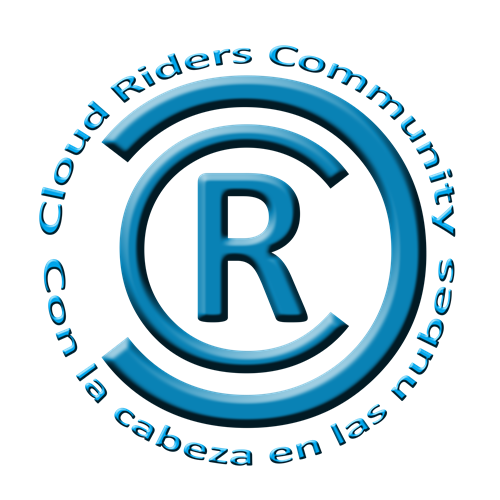

This is our small community that deals with Datacenter Engineering, Networks, Systems, IoT, Microsoft 365 and Azure.

We collaborate with several educational centers in Zaragoza and Madrid, giving talks, workshops and training for university students and higher institutes.

[If you want to see more information about the event you can consult the following website!] (https://cloudriders.es/global-azure-2022-zaragoza)

[If you want to collaborate you can also propose your session and we will be happy to have you!](https://sessionize.com/global-azure-2022-zaragoza/)

If you have any questions, proposals or want to collaborate with us, please contact the organization:

* Juan Ignacio Oller Aznar: [jioller@live.com and @jioller](https://twitter.com/jioller)