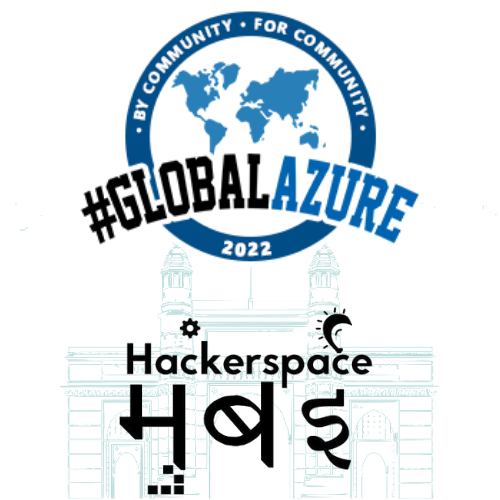

# Global Azure Bootcamp 2022 - Mumbai

In May, those clear blue skies in Mumbai herald the annual Global Azure Bootcamp.

We are calling all Azure enthusiasts from Mumbai and nearby environs to come and join us, where we share our expertise and experience.

We encourage folks identifying themselves as part of an underrepresented minority[URM] in the Mumbai technology ecosystem to attend.

While we are keeping our fingers crossed for an in-person event, we cannot forget what happened last year when the Delta variant wrecked havoc in India and we had to cancel the bootcamp. We will communicate any status change asap.

This will be our 3rd Azure Global Bootcamp, previous editions were held in  [2018](https://gab18mum.eventbrite.com/) and [2019](https://gab19mum.eventbrite.com/).

-------------------------------------------------
Hosted by [Hackerspace Mumbai](https://www.hackmum.in/), the city's largest OSS community.
You can find us on [Twitter](https://twitter.com/hackmum), [Facebook](https://fb.com/hackmum), [LinkedIn](https://www.linkedin.com/company/hackerspace-mumbai)] and organizing its longest running [tech meetup](https://www.meetup.com/Mumbai-Technology-Meetup/) #mumtechup

All our events are free for all attendees. We are committed to your privacy, and your data will never be shared.

Everyone associated with our events, including but not restricted to organizers, speakers, and attendees, are expected to abide by our [Code of Conduct](https://github.com/HackerspaceMumbai/HackerspaceMumbai/blob/master/CODE_OF_CONDUCT.md).

If you have any questions, feedback or thoughts, please reach out us at any of the social media coordinates given above or email us <community@hackmum.in>
