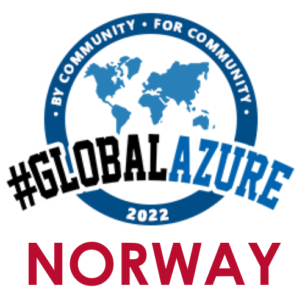

# Global Azure Norway

[Global Azure Norway](https://www.globalazurenorway.com/) is a community event organized by the [Norwegian .NET User Group in Oslo](https://www.meetup.com/NNUGOslo/). 

For the 2022 edition we are preparing to have a mix of both Virtual sessions and In-person session in Oslo. Our [call for speakers is open for both Virtual and In-person sessions](https://sessionize.com/global-azure-norway-2022). 

Please specify session type, either Virtual or In-person when you submit your proposal to [our cfp](https://sessionize.com/global-azure-norway-2022). 

[Our site](https://www.globalazurenorway.com) will be updated when we have the finalized agenda, but until then you will be able to see our agenda from last year's event Global Azure 2021.

For any comments or questions please contact us on the following email:
* oslo@nnug.no