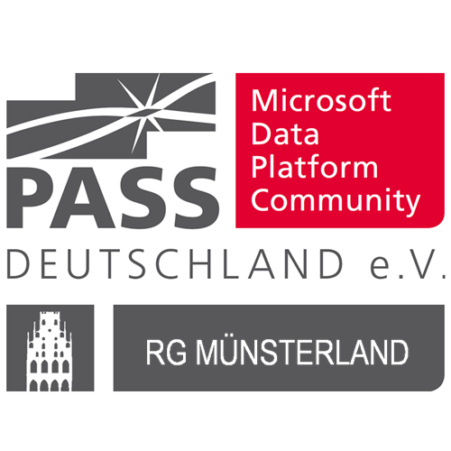

# Global Azure Portugal by Azure User Group Portugal

Global Azure Münsterland Edition is a community event organized by the PASS Deutschland Regionalgruppe Münsterland in Lüdinghausen.
All around the world user groups and communities are sharing knowledge to professionals that want to learn more about Microsoft Azure Cloud Computing and Data handling within Azure!
On May 7, 2022, we will come together to once again bring the Global Azure event tp Lüdinghausen! The PASS Deutschland Regionalgruppe Münsterland brings a one day world-class event on Microsoft Azure with many well known speakers. Join us online and don't forget to use the hashtags #GlobalAzure and @RGMuensterland on Twitter!

The [Call for Speakers is open](https://sessionize.com/global-azure-ludinghausen-2022/). Selection will happen on an ongoing basis. Don't wait to the last day to submit your sessions! 

If you have any questions, feedback or thoughts, please reach out to the community organizers at info@pass-rg-muensterland.de

More Details soon, Dirk and Frank!
