# Global Azure 2023 - Azure user group Norway

Global Azure 2023 in Norway has successfully passed, and while we eagerly wait for 2024, we thought we should share some highlights and pictures from our Global Azure meetups.
## AUGNorway supported Global Azure via regional meetups

We deciced that for Azure User Group Norway we would support Global Azure 2023 (https://globalazure.net) by organizing multiple regional meetups i Norway, during the days of May 11th to May 13th, 2023.

In the end we ended up arranging all the meetups simultaneously at the afternoon of Thursday May 11th, with the help of local sponsors that provided facilities, food and beverages.

We had three locations for our meetups during Global Azure:

### Oslo

Our Global Azure Meetup event for Oslo was sponsored by [Devoteam](https://www.devoteam.no/)!

[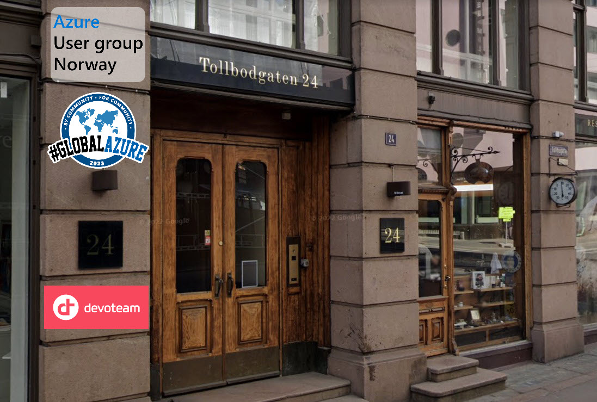](https://www.meetup.com/azure-user-group-norway/events/292412875/)

### Kristiansand

Our Global Azure Meetup event for Oslo was sponsored by [Point Taken](https://www.pointtaken.no/) and [Noroff](https://www.noroff.no/)!

[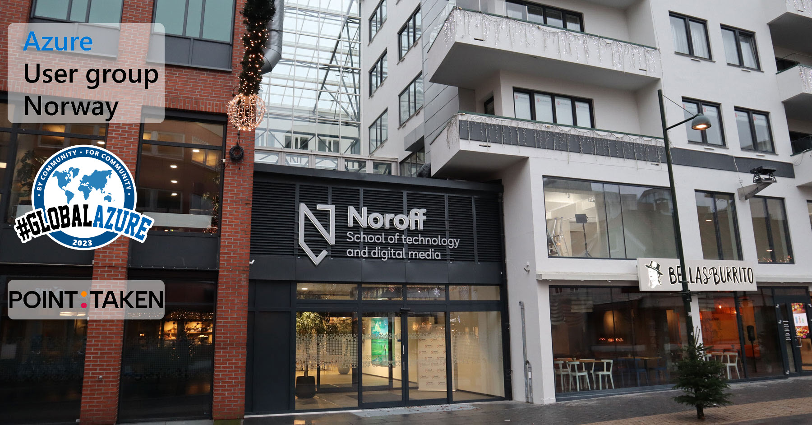](https://www.meetup.com/azure-user-group-norway/events/292412943/)

### Sarpsborg

Our Global Azure Meetup event for Sarpsborg was sponsored by [Evidi](https://www.evidi.no/)!

[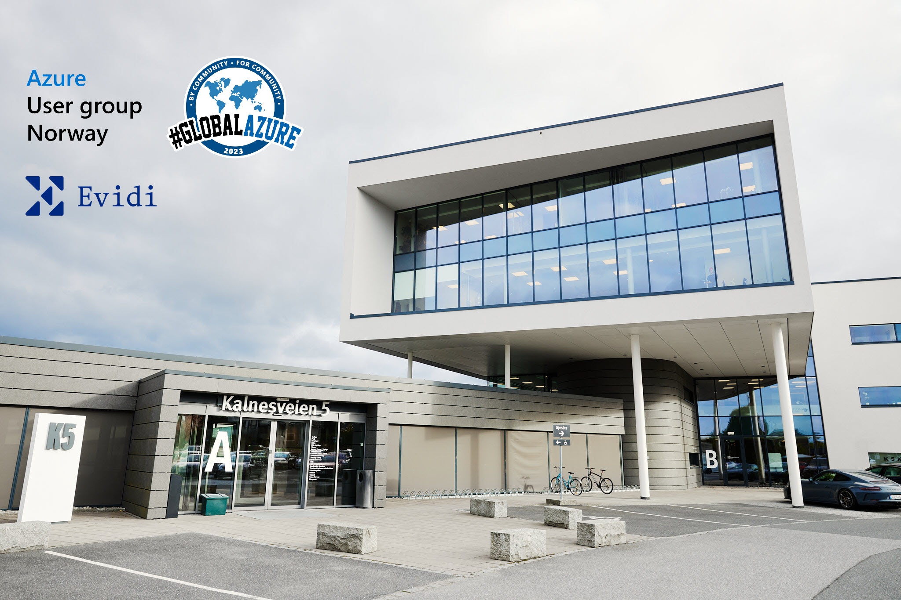](https://www.meetup.com/azure-user-group-norway/events/292403541/)

## Event Statistics

The three meetup events had the following statistics:

* **Attendees**: 120 registered attendees in total for the events, where just short of 90 actually turned up. That is in fact a great turnout for meetups that sometimes have over 50% no-shows. Especially considered this was after-work and the week before Norway celebrate its National Day which often people get occupied with family and planning.
* **Speakers**: We had 9 different speakers, where 4 where Microsoft MVPs in the Azure, Security and Cloud & Datacenter Management categories, and the other speakers were either experienced or new Community speakers, providing a diverse range of experience and personalities.
* **Sessions**: We had 3 different break-out sessions for each location, 9 sessions in total, covering up to 8-9 hours of knowledge sharing on Azure including breaks (which were used to discuss sessions and content anyway!)

## Azure Technologies Covered

With all that great sessions and speakers, we got to cover a lot of interesting Azure related technologies and content, including:

* **Microservices in Azure**: Including Azure App Services, API Management, Function Apps, Logic Apps, Containers, Event Hub, Queue and many more.
* **Azure Stack**: Including Azure Arc, Azure Stack HCI, Azure Hybrid, Windows Server, Cluster, VDI, Managed SQL, Monitoring, Policies and Security, etc.
* **Infrastructure as Code in Azure**: Including Azure Resource Manager, Bicep, Terraform, Visual Studio Code, DevOps, PowerShell, Azure CLI and more.
* **Hybrid Management with Azure Arc**: Management, Monitoring, Policies and Security for Hybrid Datasenters.
* **Delegated Identity Management in Azure**: Automation, Azure Landing Zones, Delegation, RBAC, Operational Excellence,Power Platform, Git, Bicep & Microsoft Entra.
* **Secure Infrastructure**: Security, Infrastructure as Service, Azure RBAC, Security Posture Management, Defender for Cloud.
* **Azure Synapse**: Data Ingestion, Synapse pipelines, Spark Notebooks and more.
* **Azure Logic Apps & 3rd Party Apps**: Microsoft Sentinel, Logic Apps, SaaS apps, LOB apps, Logging, APIs, Microsoft Sentinel, KQL, SIEM.
* **Cloud Security Threat Landscape**: Attack vectors, compromised cloud and misconfigurations, password spraying, hybrid environments, 'blue team', attack paths, and mitigation.

This was indeed a lot of learning shared, and the feeling was that the attendants were satisfied.

## Feedback

Overall over the 3 events we had great feedback, with a rating average of 4.75 (of 5) for the 3 events, and 90% of attendees would go again.

Feedback given was Engaging, Welcoming host, Good setting, Met new people, Inclusive attendees, Made an impact, Was as described, I felt safe, Punctual start, and Good food!

## Pictures

Here are some pictures from the Global Azure events in Norway:

[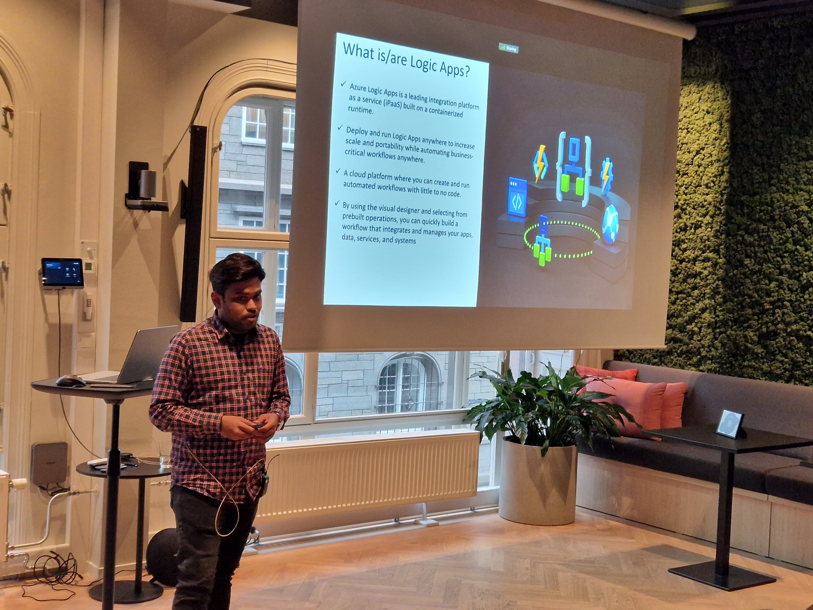](https://www.meetup.com/azure-user-group-norway/events/292412875/)

[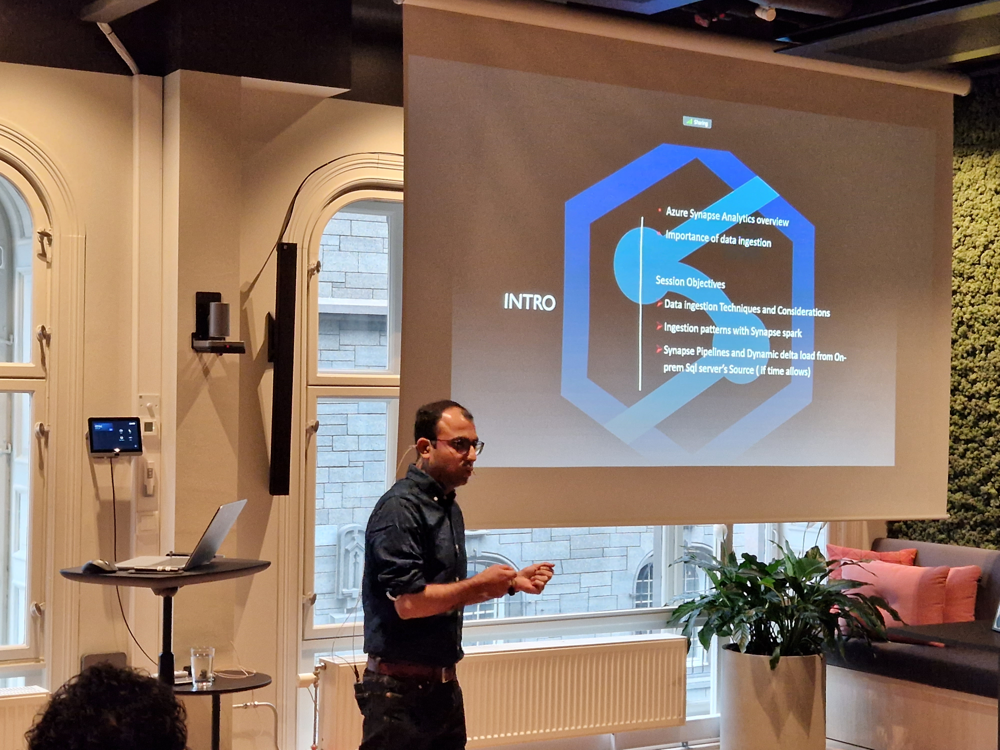](https://www.meetup.com/azure-user-group-norway/events/292412875/)

[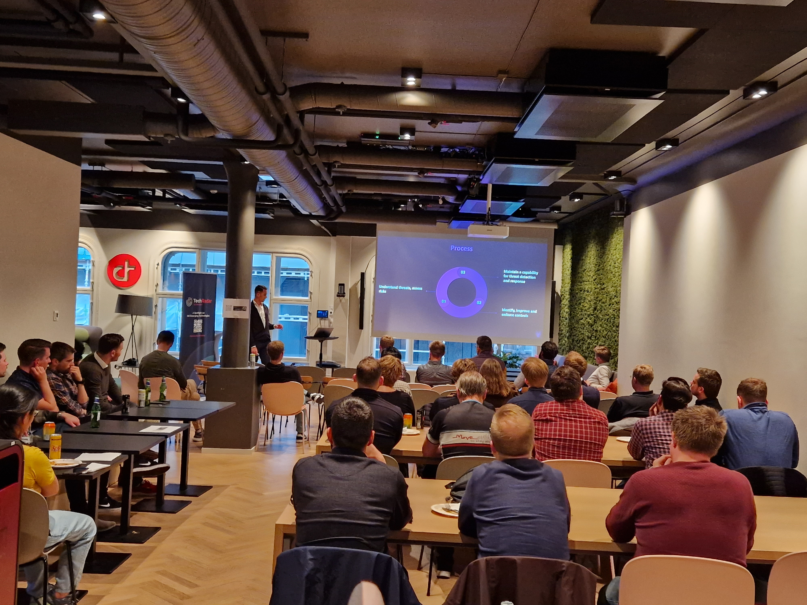](https://www.meetup.com/azure-user-group-norway/events/292412875/)

[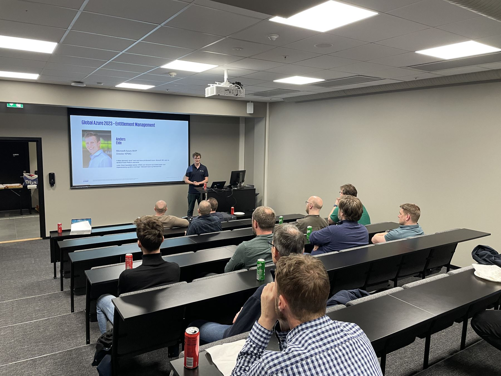](https://www.meetup.com/azure-user-group-norway/events/292412943/)

[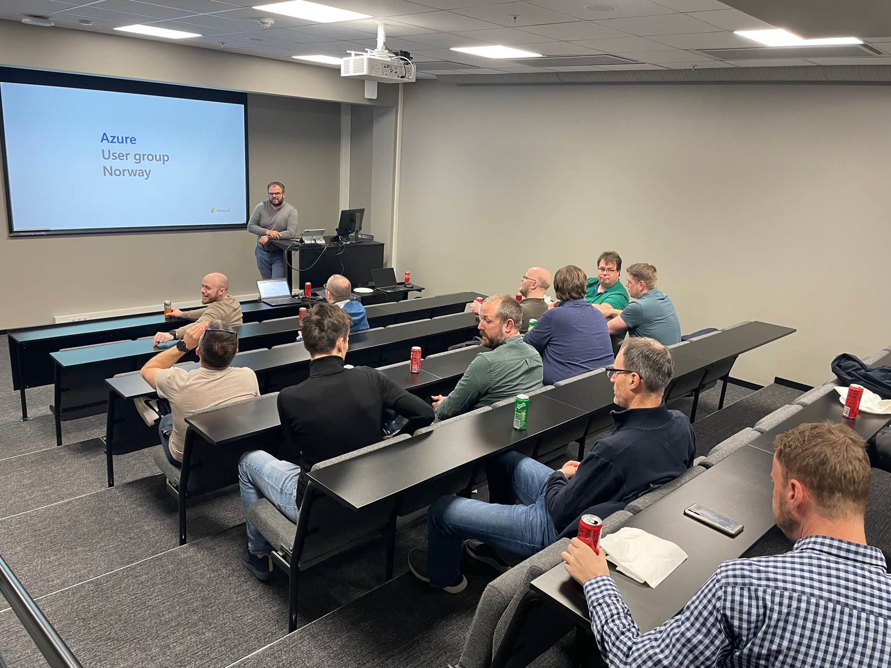](https://www.meetup.com/azure-user-group-norway/events/292412943/)

[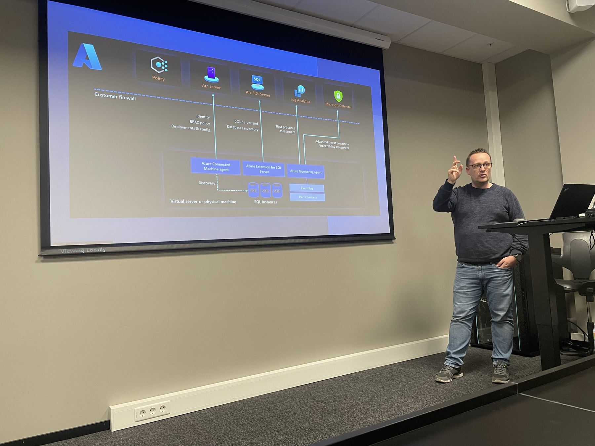](https://www.meetup.com/azure-user-group-norway/events/292412943/)

[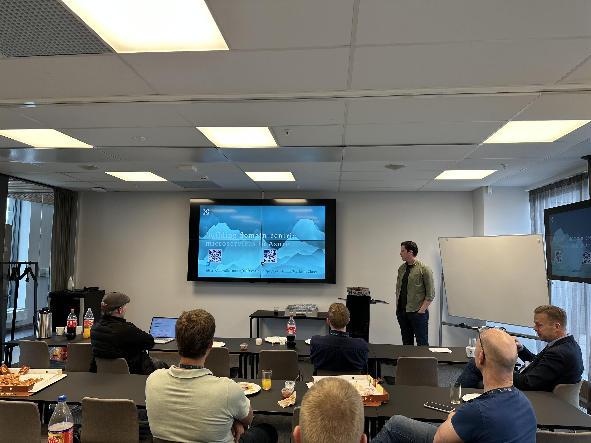](https://www.meetup.com/azure-user-group-norway/events/292403541/)

[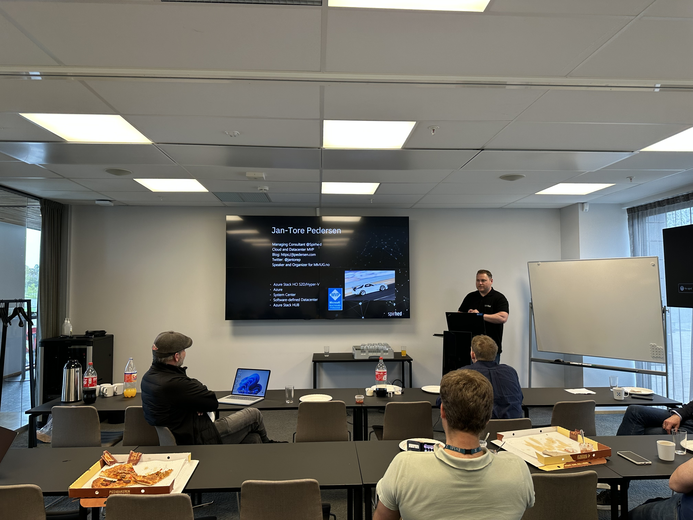](https://www.meetup.com/azure-user-group-norway/events/292403541/)

[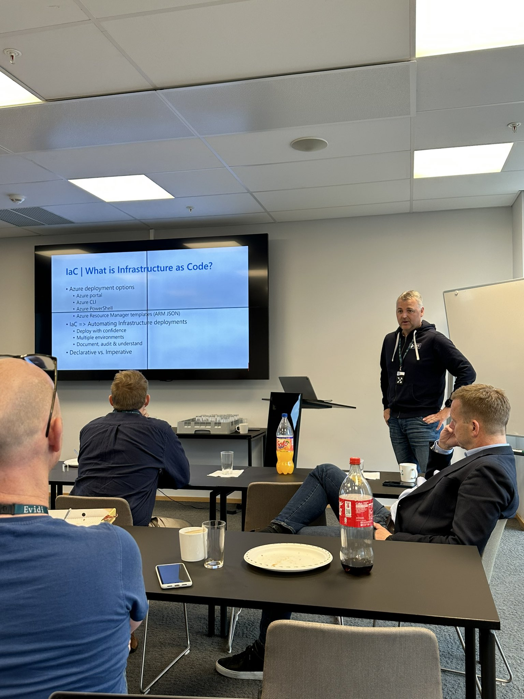](https://www.meetup.com/azure-user-group-norway/events/292403541/)

-------------------------------------------------

## Future Events, Information, Content & Community

Please follow our website, meetup group and resources for staying up to date with the Azure Community in Norway.

* **Website**: https://azureusergroup.no
* **Meetup**: https://www.meetup.com/azure-user-group-norway/
* **Github**: https://github.com/AUGNorway