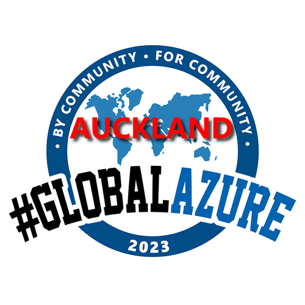

# Global Azure Auckland

We're excited to be hosting an event at the **[Auckland Azure Lunchtime Meetup](https://www.meetup.com/auckland-azure-lunchtime-meetup/)** in Auckland on **May 11th and 12th**!

We are having hybrid lunch sessions to talk about Azure!

Expect great sessions covering AI, security, identity, developer technologies, devops and beyond.

This is also a great chance to network with MVPs and experts in the Azure world.

Talks will be delivered to our live audience and streamed through Microsoft Teams.

## Tickets

Registration will be available on [Meetup](https://www.meetup.com/auckland-azure-lunchtime-meetup/) in the near future.

## Organizers

If you have any questions, feedback or thoughts, please reach out to the community organisers:

* Luke Murray [Microsoft MVP](https://mvp.microsoft.com/en-us/PublicProfile/5004796)
* Marcel Medina [Microsoft MVP](https://mvp.microsoft.com/en-us/PublicProfile/5005172)
* Rory Braybrook [Microsoft MVP](https://mvp.microsoft.com/en-us/PublicProfile/5003445)
