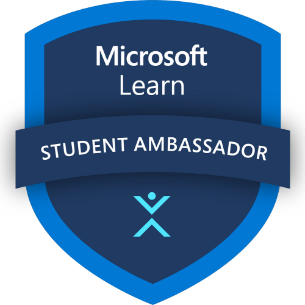

# Microsoft Learn Student Ambassadors Egypt

We're excited to be hosting an event at [Microsoft Learn Student Ambassadors Egypt](https://sessionize.com/global-azure-egypt-2023/)!

We are excited to bring back in-person events and host Global Azure Day 2023 for the Microsoft Learn Student Ambassadors Egypt Community. 

The event will be focused on all things Azure, including Cloud computing, Data management, Artificial intelligence, Cloud Security and more. Our goal is to provide attendees with the latest insights, trends, and best practices in the Azure ecosystem.

If you are an expert in any of the above areas and are interested in speaking at Global Azure 2023, we want to hear from you! Whether you are a seasoned speaker or a first-time presenter, we welcome all submissions.

Apply Here: https://sessionize.com/global-azure-egypt-2023/

Don't miss this opportunity to share your knowledge and network with fellow Azure enthusiasts at Global Azure 2023 in Bengaluru. We can't wait to hear from you!

* 📅May, 12 2023
* 🏠Online
* 🎙️Call for speakers - https://sessionize.com/global-azure-egypt-2023/
* 💶Sponsors - We are looking for sponsors. Reach out to the organizing team.
