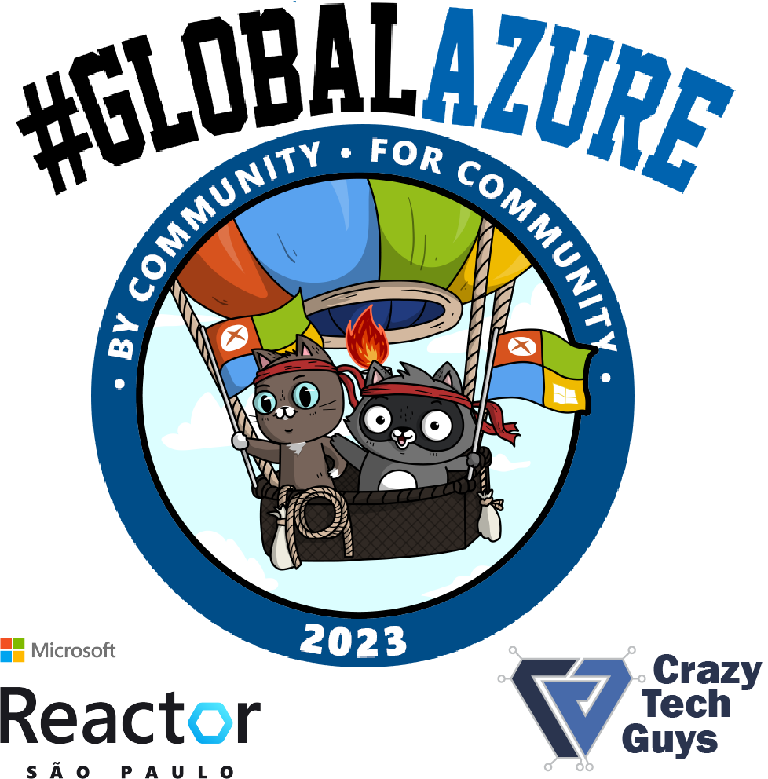

# Global Azure 2023 - Reactor São Paulo

Estamos muito animados para receber vocês no [Reactor SP, clique aqui para se inscrever](https://aka.ms/GlobalAzure2023)!

Vai ser demais!

No dia 12 de maio estaremos juntos com as comunidades no Global Azure 2023. Nosso evento será híbrido com transmissão ao vivo para que todos possam participar e aprender sobre Azure com os melhores líderes da comunidade. Junte-se a nós para ter acesso a palestras e workshops que cobrirão os mais diversos tópicos sobre o universo do Azure, incluindo segurança, soluções de nuvem, inteligência artificial, IoT e muito mais. Com a presença de especialistas Microsoft e líderes da indústria, você terá acesso a insights e conhecimentos exclusivos para ajudá-lo a impulsionar sua carreira e expandir sua expertise em nuvem. 

Não perca a chance de participar deste evento único que promove o compartilhamento de conhecimento e o fortalecimento da comunidade de desenvolvedores e profissionais de nuvem em todo o mundo. 

Registre-se agora e participe do Global Azure 2023!

** Todas as incrições devem ser feitas somente pelo [Reactor SP, clique aqui para se inscrever](https://aka.ms/GlobalAzure2023)!!

A grade de palestras será fornecida em breve, o evento será feito no modelo híbrido, presencialmente no Reactor de SP e online para quem não puder estar no local. 

Organizado por duas pessoas bonitas: 
Angelo Belchior [twitter](https://twitter.com/angelobelchior)
Jorge Maia [twitter](https://twitter.com/jorgemaia)

