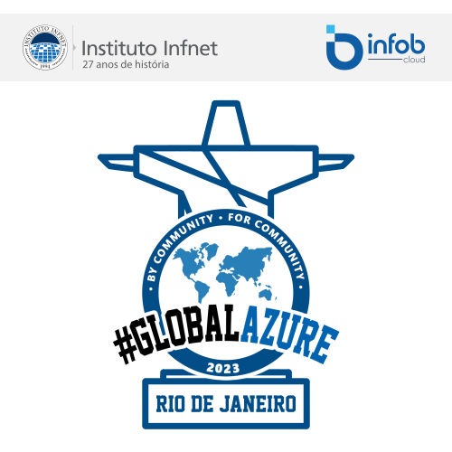

# Global Azure Bootcamp Rio

Estamos de volta para mais uma edição do [Global Azure Bootcamp Rio](http://gabrio.azurewebsites.net/)!

No dia 11 de maio de 2023 estaremos juntos no Instituto Infnet das 18:00h às 22:00h.

Este é um evento de grande importância para a comunidade de tecnologia em todo o mundo e, sem dúvida, um dos maiores eventos sobre Azure da atualidade.

Como você já sabe, a nuvem está se tornando cada vez mais importante no mundo dos negócios, e o Azure faz parte dessa revolução. O Azure Bootcamp é uma oportunidade única para aprender e se conectar com outros profissionais de tecnologia e especialistas em Azure.

Durante o evento você terá a oportunidade de participar de sessões informativas e palestras, além de se conectar com outros profissionais. O objetivo é fornecer a você um ambiente colaborativo, para que você possa expandir seus conhecimentos.

Aqui estão algumas das razões pelas quais você não pode perder este evento:

Você vai ouvir palestras de profissionais do mercado, especialistas em tecnologia e Azure.
Você vai se conectar com outros profissionais, o que pode levar a novas oportunidades.
Você vai se tornar um dos milhares de participantes do Evento Global Azure Bootcamp, que ocorre em todo o mundo, e se juntar à crescente comunidade de profissionais.

Não perca a oportunidade de participar deste evento incrível. Esperamos vê-lo lá!
