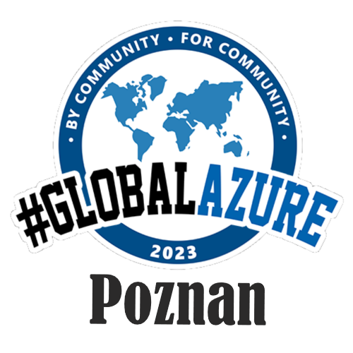

# Global Azure 2023 Poznań Edition

Link do strony wydarzenia: [http://globalazurepoznan.pl/](http://globalazurepoznan.pl/)

Jak co roku, w ciągu 3 dni, społeczności na całym świecie organizują lokalne wydarzenia on-site, hybrydowo oraz transmisje na żywo dla zainteresowanych rozwiązaniami Microsoft Azure. Wszystko po to, by dać Wam możliwość dowiedzieć się jak najwięcej o platformie Microsoft Azure od najlepszych w swojej klasie liderów społeczności.

W tym roku organizujemy to wydarzenie również w Poznaniu! Ze względu na ograniczoną liczbę miejsc, zapisz się jak najszybciej. Jeżeli okaże się, że nie możesz się pojawić, daj nam znać. Pozwoli nam to zaprosić innych z listy rezerwowej.

# Rozkład jazdy wygląda następująco:
13.05. sobota, biuro Nordcloud w Kupcu Poznańskim (wejście przy kiosku, winda D, 5. piętro)

## 9:00 - 13:00 - Warsztaty Bicep - from Zero to Hero

Poziom: Junior (100)
Prowadzący warsztat: Artur Mucha, CloudOps Lead, Nordcloud

~~15:00 - … - Prelekcje i networking~~

**W związku z małym zainteresowaniem, część związana z prelekcjami zostaje odwołana. Dzięki temu zyskamy przestrzeń na przedłużenie warsztatów!**

Wydarzenie jest w 100% darmowe! Od społeczności - dla społeczności! I dlatego, jako społeczność - chcemy pomagać i mnożyć nasze dobro! Przy okazji tej edycji wydarzenia pomagamy naszemu koledze Grzegorzowi i jego choremu synkowi Remkowi - wejdź, wesprzyj i zapoznaj się z ich historią: https://www.siepomaga.pl/remek-kieszkowski.
