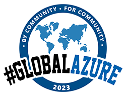

# Global Azure London

We're excited to be hosting an event at the **[Microsoft Reactor](https://developer.microsoft.com/reactor/events/19851/)** in London on **May 12th**!

Expect a day packed full of awesome Azure talks, covering everything from PaaS, DevOps, IoT, AI / ML, security, tooling, and beyond.

This is also a great chance to network with MVPs and experts in the Azure world.

Talks will be delivered to our live audience and streamed on the Microsoft Developers YouTube channel. [Sign up now to secure your space!](https://developer.microsoft.com/reactor/events/19851/)

If you have any questions, feedback or thoughts, please reach out to the community organisers:

* Callum Whyte [Microsoft MVP](https://mvp.microsoft.com/en-us/PublicProfile/5003682) [@callumbwhyte](https://twitter.com/callumbwhyte)
* Poornima Nayar [Microsoft MVP](https://mvp.microsoft.com/en-us/PublicProfile/5004155) [@PoornimaNayar](https://twitter.com/PoornimaNayar)
