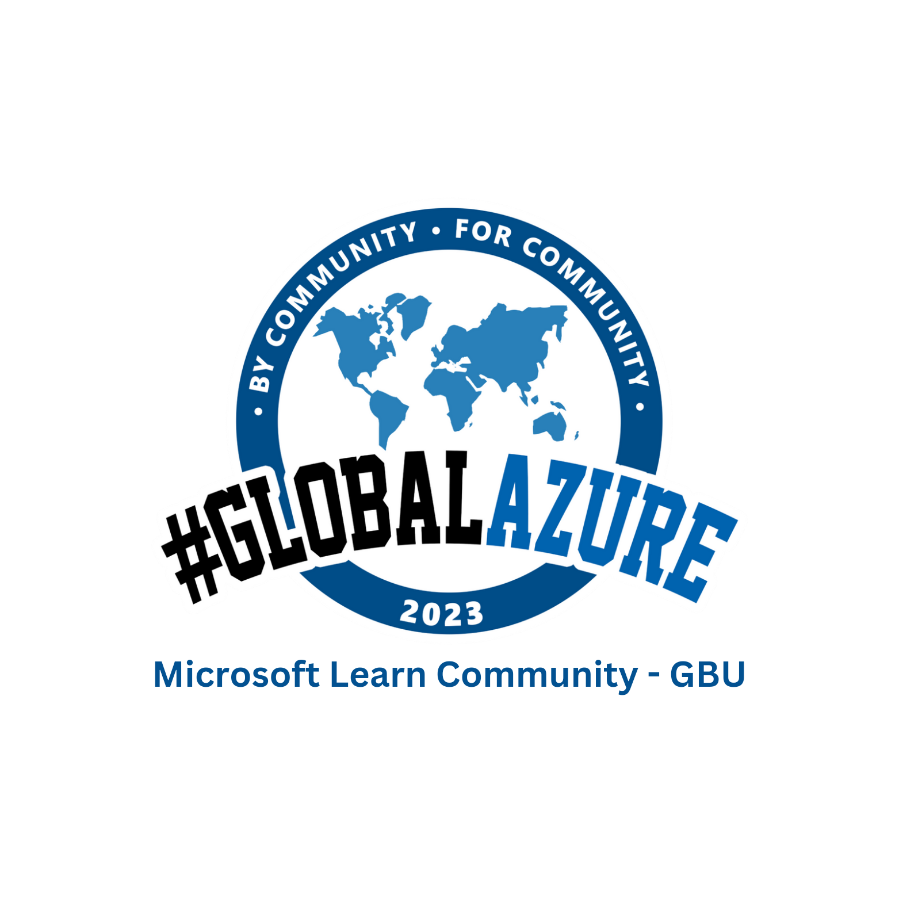

Microsoft Learn Community Global Azure 2023
===

Welcome to Microsoft Learn Community Global Azure 2023 Bootcamp!

Our community is run by students from Gautam Buddha University and Microsoft Learn Student Ambassadors. It focuses on Microsoft products like Azure and also other tools for developers and businesses. We organize online and in-person events for technology enthusiasts of all skill levels to connect, learn, and grow. Join us to expand your knowledge, network with like-minded individuals, and become part of a vibrant community passionate about technology.

We will be hosting a in-person bootcamp for Global Azure 2023 covering broad variety of topics from speakers coming from diverse backgrounds.

The [Call for Speakers is open](https://sessionize.com/microsoft-learn-community-global-azure-2023/). Selection will happen on an ongoing basis. Don't wait to the last day to submit your sessions!!! 

Session information:
* 📅May 12th, 2023
* 🏠In-person location: Management Auditorium, Gautam Buddha University, Greater Noida, Uttar Pradesh 201312
Greater Noida, India
* 🎫 Register for the bootcamp here: [Register here](https://forms.gle/HS9DvihatJFC8Qbu6)
* 💶Sponsors - We are looking for sponsors. Reach out to the organizing team.

If you have any questions, feedback or thoughts, please reach out to the Community organizer:

* Ronak Singh [Microsoft Learn Student Ambassador](https://www.linkedin.com/in/srronaksingh/)
