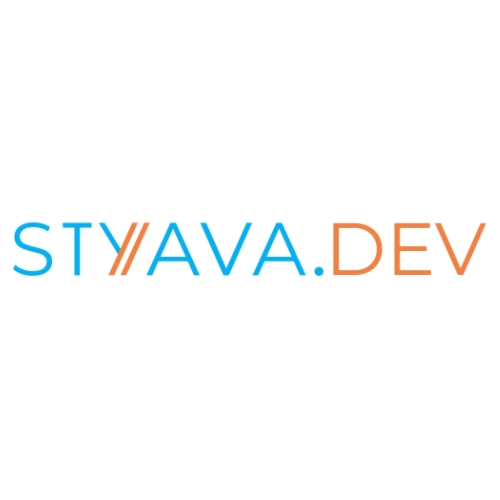

Talking about community activities, we conduct Technical events, Certification training, and Cloud skill challenges. Technical events are specific topics on Azure, java, AI, Python and open source, Trainings are on Azure which is run by MCT and 3 to 5 days long most beneficial for whoever is going for a certification exam and CSC to show you cloud skill and win prizes. These online events and training are led by MVPs, MCTs and tech experts around the globe and conducted live.