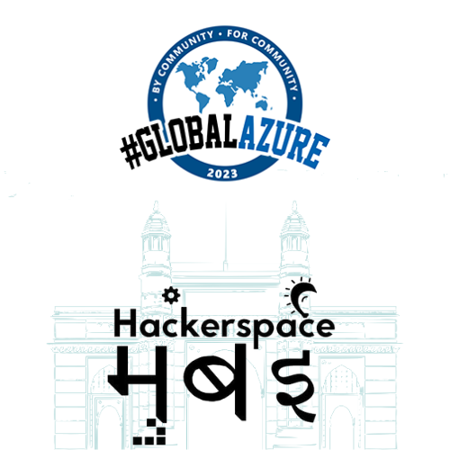

# Global Azure Bootcamp 2023 - Mumbai

## नमस्कार, मुंबई 🙏

In May, the cloud-laden blue skies above Mumbai herald the annual Global Azure Bootcamp.

We are calling on all Azure enthusiasts from Mumbai, and its nearby environs to come and join us, where we share our expertise and experience.

We strive for diversity, inclusiveness, and equity. All are invited to apply, and we strongly  encourage first time speakers and especially, folks identifying themselves as part of an underrepresented minority[URM] in the Mumbai technology ecosystem to apply to our [Call for Papers[CfP]](https://sessionize.com/gab23mum/).

This will be our 5th straight Azure Global Bootcamp; previous editions were held in [2018](https://gab18mum.eventbrite.com/), [2019](https://gab19mum.eventbrite.com/), [2021](https://gab21mum.eventbrite.com/), & [2022](https://gab22mum.eventbrite.com/). We skipped 2020 due to the `COVID pandemic`.

-------------------------------------------------
Hosted by [Hackerspace Mumbai](https://www.hackmum.in/), the city's largest OSS community, and organizers of its longest running [tech meetup](https://www.meetup.com/Mumbai-Technology-Meetup/) #mumtechup

All our events are free for all attendees. We are committed to your privacy, and your data will never be shared.

Everyone associated with our events, including but not restricted to organizers, speakers, and attendees, are expected to abide by our [Code of Conduct](https://github.com/HackerspaceMumbai/HackerspaceMumbai/blob/master/CODE_OF_CONDUCT.md).

If you have any questions, feedback or thoughts, please reach out us at any of the social media coordinates given above or email us <community@hackmum.in>

You can find us on [Twitter](https://twitter.com/hackmum), [Facebook](https://fb.com/hackmum), [LinkedIn](https://www.linkedin.com/company/hackerspace-mumbai), [Youtube](https://www.youtube.com/c/HackerspaceMumbai), and [Github](https://github.com/orgs/HackerspaceMumbai/)
