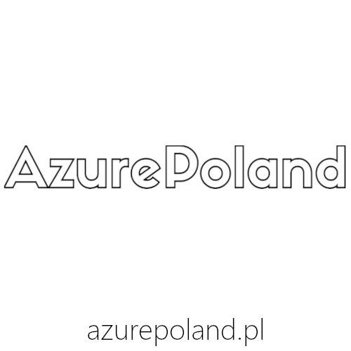

# AzurePoland Community

Visit our website at <https://azurepoland.pl>

If you have any questions, feedback or thoughts, please reach out to the community organizers:

- Piotr Rogala [Azure MVP](https://mvp.microsoft.com/en-us/PublicProfile/5002690?fullName=Piotr%20Rogala)
- Michał Jankowski [Azure MVP](https://mvp.microsoft.com/en-us/PublicProfile/5003223?fullName=Michal%20Jankowski)

# Event description

Title: **GitHub - building a conteniriezed app release to Azure using alternative to Azure DevOps**

The workshop is a training session aimed at teaching participants how to build and release applications to Microsoft Azure using GitHub instead of Azure DevOps.

During the workshop, participants will learn how to set up a GitHub repository for a conteniriezed test application, configure the necessary GitHub Actions workflows for building and testing the application code, and then deploy the application to Azure using an alternative to Azure DevOps, such as the GitHub actions.

The workshop is designed for developers, DevOps engineers, and cloud engineers who are familiar with both GitHub and Azure and want to learn how to integrate the two platforms for building and releasing applications. The workshop will cover key concepts and best practices for using GitHub and Azure together, as well as hands-on exercises to help participants apply what they have learned.

Level: intermediate **(200/300)**

Language: **Polish**

## Prerequisites:
1. Own Laptop
2. Azure subscription - <https://azure.microsoft.com/en-us/free/>
3. GitHub repostory - <https://github.com/>
4. Visual Studio Code - <https://code.visualstudio.com/> (+ installed extensions like: Docker, Git, Azure login)
5. Docker - <https://www.docker.com/>
6. General knowledge about Azure, Azure Pipelines, GitHub Actions

## Presenters:

**Szymon Pulka** (Hued.me) - A programmer living with his head in the cloud, for whom Azure is an avenue to optimize and simplify processes. He takes a creative approach to programming, seeing it as a tool to change the world around him. Founder and Head at Hued.me - a company where he combines IT solutions with communication design.

**Piotr Rogala** (Nordcloud) - Piotr working at Nordcloud, where he deals with cloud solutions based on Microsoft Azure solutions. He is the leader of the Wroclaw Azure team and supports clients in digital transformation to the cloud for increasing their business potential. At the universities of WSB, WSH, and WSIZ Copernicus, he conducts postgraduate copyright classes, sharing the practical knowledge he has acquired throughout his career. For the last three years in a row, he has been awarded the MVP - Most Valuable Professional award by Microsoft. He is a certified trainer confirmed by MCT - Microsoft Certified Trainer award. In his free time, in his free time, he organizes and participates in many workshops, often as a key speaker. He is also the organizer of the Microsoft Azure User Group Poland group in Wrocław. His portfolio includes projects related to the automation of the launch of complex environments on-demand in the clouds of various suppliers. He also built an automation process for the application of a leading American ERP software provider and service for universities around the world.

## url: <https://www.eventbrite.com/e/global-azure-2023-tickets-590184797617>

