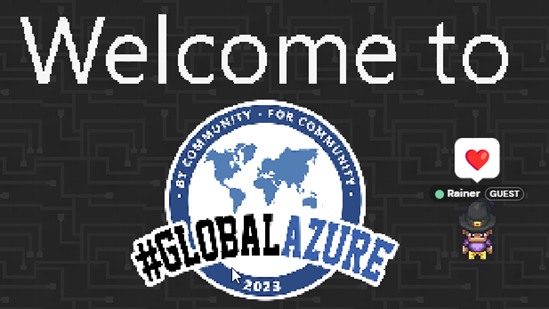

# Reflecting on the Global Azure Austria 2023 - Highlights and Insights

The curtains closed recently on Global Azure Austria 2023 [https://globalazure.at](https://globalazure.at). True to its longstanding tradition, this year's conference saw numerous experts, sponsors, and technology enthusiasts gather, albeit virtually, to exchange knowledge, ideas, and advancements in the Azure ecosystem.

The Global Azure Austria adapted again to a fully virtual format this year. Despite the lack of physical interaction, the event managed to recreate the same passion and intensity associated with its in-person predecessors. Using StreamYard as a broadcasting platform, 23 live sessions were aired, offering enriching content to its audience. These sessions were streamed on YouTube, allowing individuals around the world to part in this event.

This year's conference welcomed a remarkable assembly of 27 international speakers who delivered their sessions in four parallel tracks. Comprised of many Microsoft Most Valuable Professionals (MVPs), Regional Directors (RDs), and other accomplished industry experts, the event lived up to its reputation as a hub of expert insights and forward-thinking discourse.

Emphasizing the need for networking and interactions, the event featured a custom-designed environment on gather.town. This interactive setting served as a platform for networking, expo, and Q&A sessions, effectively bridging the gap left by the physical distance. The environment was not without its share of fun elements either. Attendees could partake in a virtual scavenger hunt or take a break riding around with virtual llamas and go-karts, introducing a lighter side to the otherwise intensive conference.

Throughout the duration of the conference, approximately 220 participants actively engaged in the various sessions and activities, reflecting the robust interest in Azure technologies. To extend the reach and impact of the conference, all 23 sessions have been made [available on YouTube](https://www.youtube.com/@CodingClubLinz), along with an intro video styled in Global Azure aesthetics. This step ensures that the content is accessible to a larger audience, thereby spreading the essence of the conference beyond its event dates.

Behind the successful execution of this virtual event was a dedicated team of community members, with Rainer Stropek, an MVP and RD from Austria, playing a significant role.

In conclusion, Global Azure Austria 2023 was an event that harmoniously combined the essence of its rich history with the need for a modern, virtual approach. We look forward to seeing how the event continues to inspire the Azure community in the DACH region in the years to come.
