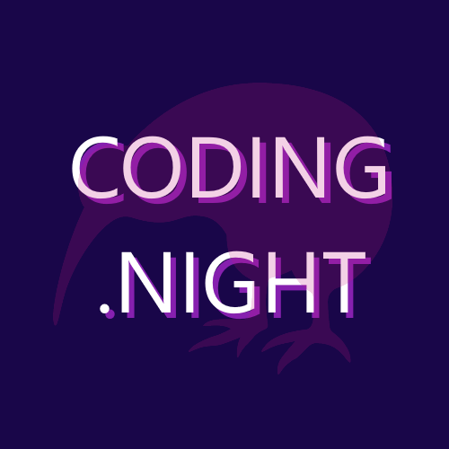

# Global Azure Auckland

We're excited to be co-hosting an event at the **[Coding Night NZ](https://www.meetup.com/coding-night-nz/)** in Auckland on **May 11th, 12th and 13th**!

We are having hybrid lunch sessions on May 11th, 12th at Microsoft Auckland, and online on May 13th to talk about Azure!
Expect great sessions covering AI, security, identity, developer technologies, devops and beyond.

This is also a great chance to network with MVPs and experts in the Azure world.

Talks will be delivered to our live audience and streamed on Coding Night NZ YouTube channel.

## Call for speakers

If you are interested in speaking at Global Azure Auckland on May 13th, submit your sessions at [Sessionize](https://sessionize.com/global-azure-auckland-2023/).

## Organizers

If you have any questions, feedback or thoughts, please reach out to the community organisers:

* Luke Murray [Microsoft MVP](https://mvp.microsoft.com/en-us/PublicProfile/5004796)
* Marcel Medina [Microsoft MVP](https://mvp.microsoft.com/en-us/PublicProfile/5005172)
* Rory Braybrook [Microsoft MVP](https://mvp.microsoft.com/en-us/PublicProfile/5003445)
