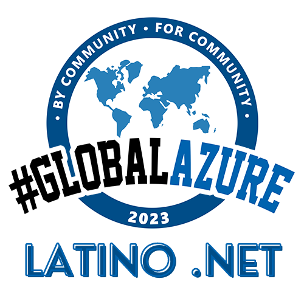

# Community title

¡Bienvenidos al evento de Global Azure en Latinoamérica! En el marco de Globa Azure este evento es una oportunidad única para aprender todo lo que necesitas saber sobre los recursos que Azure provee en tu idioma. Únete a nosotros para una serie de sesiones informativas impartidas por expertos de la industria, quienes te guiarán a través de las diferentes soluciones que Azure ofrece para el almacenamiento, procesamiento y análisis de datos, así como para la implementación de aplicaciones web, móviles y empresariales. Además, podrás conocer las últimas novedades y tendencias de la plataforma, y obtener consejos prácticos para sacar el máximo provecho de ella. Este evento está diseñado para todos aquellos interesados en Azure, ya sean desarrolladores, arquitectos, administradores de sistemas, o simplemente apasionados por la tecnología.

