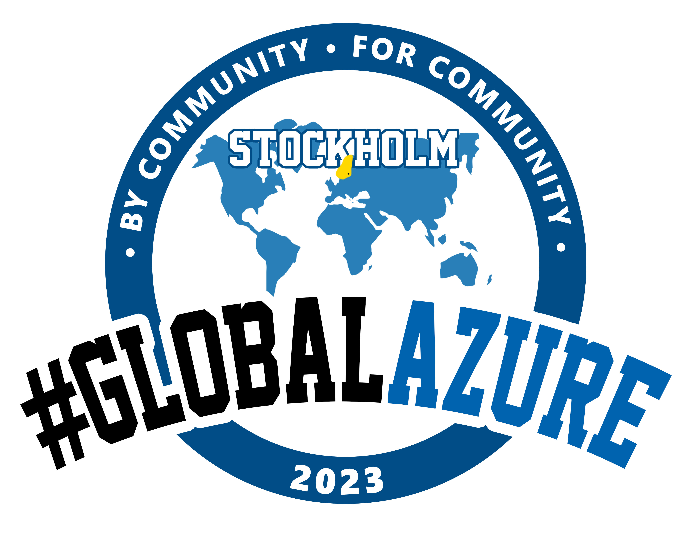

# Global Azure Stockholm

Not so much a regular community as a couple of people who wanted in on the Global Azure fun!

Event to take place at Microsoft Reactor, Regeringsgatan 59 Stockholm, on the 12th of May, on-prem and live streamed at Microsoft Reactor YouTube channel.

## Tickets

Tickets / seat reservation available at [Meetup](https://www.meetup.com/vasteras-azure-user-group/events/291645252/).

## Call for speakers

If you are interested in speaking at Global Azure Stockholm, submit your sessions at [Sessionize](https://sessionize.com/global-azure-stockholm-2023/). CfS is open until 17 Mar 2023.

## Organizers

If you have any questions, feedback or thoughts, please reach out to the community organizers or send us an email on meetup@vazug.cloud:

- [Björn Sundling - @Bjompen](https://twitter.com/Bjompen)
- [Simon Wåhlin - @SimonWahlin](https://twitter.com/SimonWahlin)
- [Stefan Ivemo - @StefanIvemo](https://twitter.com/StefanIvemo)
- [Emanuel Palm - @PalmEmanuel](https://twitter.com/PalmEmanuel)

