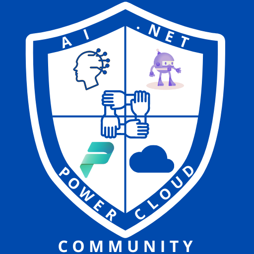

# Global Azure AI .NET Power Cloud Community

During this exceptional journey, technology communities, students, and professionals from across the region will gather to celebrate a new edition of the Global Azure event. This presents a magnificent opportunity to learn directly from the experts and industry leaders who are shaping the future of cloud computing. Participants will gain advanced knowledge of Azure, discover its most innovative features, security enhancements, and creative solutions to complex business challenges. Furthermore, the event provides a space to connect with peers, meet new professionals in the field, and exchange ideas in a dynamic and collaborative environment. This experience promises not only to enrich technical understanding but also to build valuable relationships, opening doors to future collaborations and professional opportunities.

## AI .NET Power Cloud Community
Join our community and take a qualitative leap in your tech career. We specialize in .NET, Artificial Intelligence, Azure Cloud, and Power Platform, providing a unique platform for networking events, talks with renowned experts, and bootcamps that will prepare you for tomorrow's challenges. Here, your passion for technology translates into professional growth and unprecedented opportunities in the tech world.

[AI .NET Power Cloud Community]([http://virtualdevshow.com/](https://linktr.ee/ainetpowercloud))
