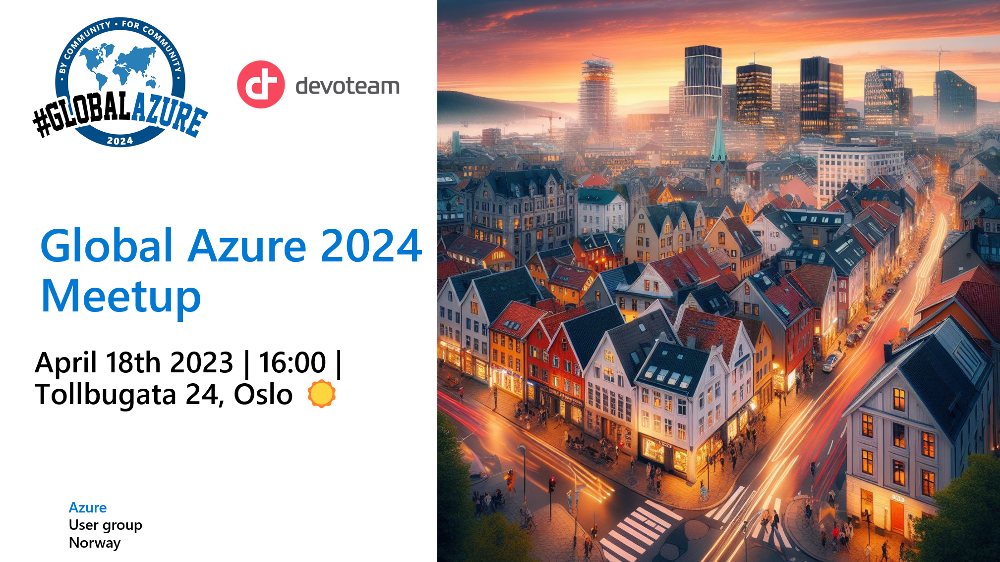
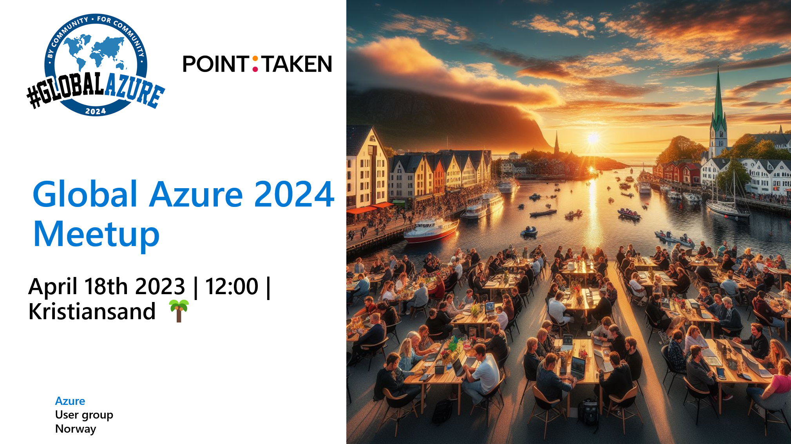
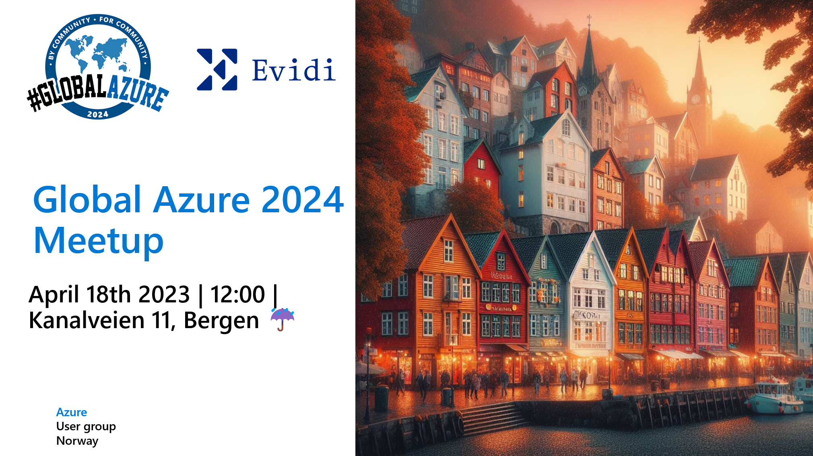

# Global Azure 2024 - Azure user group Norway

Global Azure 2024 will once again be supported by Azure User Group Norway!

## AUGNorway supports Global Azure via regional meetups

We plan to support Global Azure 2024 (https://globalazure.net) by organizing multiple regional meetups i Norway, during the days of April 18th to April 20th, 2024.

Planning is underway, and several locations are confirmed, se below links. We are looking for organizations and members of our network that would like to sponsor and contribute to a regional event. See more info under sponsors below.

### Oslo

Our Global Azure Meetup event for Oslo is being sponsored by [Devoteam](https://www.devoteam.no/)!

### Kristiansand

Our Global Azure Meetup event for Kristiansand us being sponsored by [Point Taken](https://www.pointtaken.no/)!

### Bergen

Our Global Azure Meetup event for Bergen is being sponsored by [Evidi](https://www.evidi.no/)!

## Speakers

Do you want to speak and present a session at one of our Global Azure events in Norway? Submit your session at our CfP link: https://sessionize.com/global-azure-norway-2024

## Sponsors

We are looking for sponsors that can help organize and facilitate regional events during the Global Azure 2024.

* Sponsors are encouraged to provide location facilities, food and/or refreshments for attendees.
* Sponsors are encouraged to suggest own speakers and subjects, and/or welcome joining speakers that want to present on the regional event.
* Format of regional events can be one of or a combination of:
  * Day or afternoon meetups on Thursday 18th or Friday 19th
  * Day meetup or workshop on Saturday 20th

The Azure User Group Norway will help regional events and sponsors by:

* Providing a Call for Speakers dedicated for Global Azure 2024 on Sessionize.
* Providing Meetup events on our Meetup group containing 2500 members, that will help facilitate RVSP and communication with attendees.
* Support the regional event organizers in any way we can.

If you like to sponsor a Global Azure event, contact one of the organizers on LinkedIn.

-------------------------------------------------

## Future Events, Information, Content & Community

Please follow our website, meetup group and resources for staying up to date with the Azure Community in Norway.

* **Website**: https://azureusergroup.no
* **Meetup**: https://www.meetup.com/azure-user-group-norway/
* **Github**: https://github.com/AUGNorway