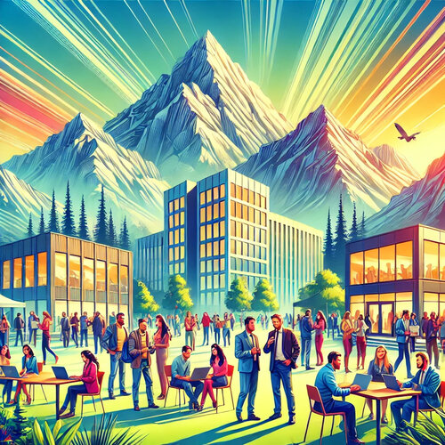

# Welcome to Andorra Tech & Startups Community!

🌐 Welcome to the Andorra Tech & Startups community! We are a dedicated group aiming to create a vibrant technological community in Andorra. This platform is designed for professionals, enthusiasts, and students who are passionate about technology and entrepreneurship.

---

## About Our Group

### 🚀 Who We Are

Join our Technology Talks and Networking Group in Andorra!

If you're passionate about technology and entrepreneurship, this is the place for you. We organize talks and networking sessions, both in-person and online, about Startups and the latest innovations in AI, Cloud Computing, Big Data, Blockchain, Open Source, WASM, and more.

### 🎯 Our Mission

**Learn, Share, and Connect:** Come to learn about the latest trends, share your knowledge, and connect with other enthusiasts and professionals. Everyone is welcome to participate and give talks. We look forward to seeing you!

### 📲 Stay Connected

- **Website:** [Andorra Tech & Startups](https://www.andorratechstartups.com)
- **Meetup:** [Andorra Tech & Startups Meetup](https://www.meetup.com/andorratech/)
- **LinkedIn:** [Andorra Tech & Startups LinkedIn](https://www.linkedin.com/groups/9876179/)
- **Facebook:** [Andorra Tech & Startups Facebook Group](https://www.facebook.com/groups/andorratech)
- **Other Social Media:** [Linktree](https://linktr.ee/andorratech)

### 📧 Contact Us

For any questions, feedback, or to get involved, please reach out to us at [contact@andorratechstartups.com](mailto:contact@andorratechstartups.com).

---

## Andorra Tech & Startups Community Event

### 📅 About the Event

Join us for a free in-person event, with streaming available so no one misses out. This unique event is designed for all technology enthusiasts, from startups to industry experts. Moreover, this is the first edition of a series of events that will take place 1 or 2 times a year, featuring new updates on the latest technological trends, new training sessions, and top-level speakers.

### 🔍 Event Highlights

- **Latest Trends:** Learn about the latest trends in startups and technology, including Frontend, Backend, Cloud, AI/ML, Blockchain, and more.
- **Workshops:** Participate in interactive workshops and solidify your knowledge.
- **Case Studies:** Dive into detailed case studies showing how emerging technologies are transforming various industries.
- **Networking:** Meet other professionals and tech enthusiasts to exchange ideas and create opportunities.

### 🌟 Key Information

- **Date:** December 21-22, 2023
- **Location:** To be announced
- **Call for Speakers:** Interested in speaking? Please send your session proposals to [contact@andorratechstartups.com](mailto:contact@andorratechstartups.com)
- **Free Ticket:**
- **Sponsors:** If you want to contribute to making this event better, please [contact us](mailto:contact@andorratechstartups.com)

### 💬 Get Involved

- **Speakers:** Do you want to speak and present a session at our Andorra Tech & Startups event? Submit your session proposals to [contact@andorratechstartups.com](mailto:contact@andorratechstartups.com)
- **Organizers:** If you want to collaborate with us as an organizer, please get in touch at [contact@andorratechstartups.com](mailto:contact@andorratechstartups.com)

### 🎯 Event Goals

The motivation behind Andorra Tech & Startups is to create a technological community in the region and to disseminate free educational events to promote technology and connect people within the community.

**All applications will be reviewed and evaluated by a committee of experts and scored based on technical criteria. The highest-scoring applications will be selected. All participants will compete on equal terms; there will be no individual preferences for speakers, and the evaluation will focus on the quality of the presentation and the work performed.**

### 🌐 Follow Us

Stay up-to-date with our future events, information, content, and community activities:

- **Website:** [Andorra Tech & Startups](https://www.andorratechstartups.com)
- **Meetup:** [Andorra Tech & Startups Meetup](https://www.meetup.com/andorratech/)
- **LinkedIn:** [Andorra Tech & Startups LinkedIn](https://www.linkedin.com/groups/9876179/)
- **Facebook:** [Andorra Tech & Startups Facebook Group](https://www.facebook.com/groups/andorratech)
- **Other Social Media:** [Linktree](https://linktr.ee/andorratech)

We are excited to bring this event to the Andorra community and look forward to your participation and support!
