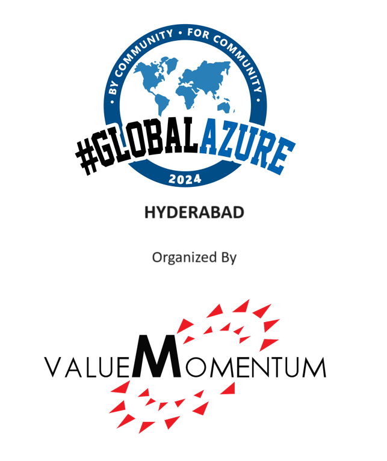

# Global Azure 2024 - Hyderabad

[]

Welcome to Global Azure Bootcamp 2024!

All around the world user groups and communities want to learn about Azure and Cloud Computing! From 18th-20th April 2024, all communities will come together once again in the great Global Azure Bootcamp event! Each community will organize their own one day deep dive class on Azure the way they see fit and how it works for their members. The result is that thousands of people get to learn about Azure and join together online under the social hashtag #GlobalAzure! 

ValueMomentum is thrilled to host the 7th annual Global Azure community event in Hyderabad! On April 20th, join the vibrant Azure community for an in-person event focused on the latest advancements and innovations in Microsoft Azure space. We look forward to the vibrant community members to join us on this fantastic day.

Global Azure event will be held at ValueMomentum Towers, Hyderabad and is open to all who are interested in everything Azure. We have interactive and experiential sessions lined up for you. 

Visit https://globalazure2024.azurewebsites.net/ to register and learn more about our sessions and speakers. 

Event Details:
* 📅April, 20 2024
* 🏠Valuemomentum Software Services, Plot No 36 & 37, ValueMomentum Towers, Financial District, Nanakaramguda, Telangana 500032
* 💶Sponsors - We are looking for sponsors. Reach out to the organizing team.

If you have any questions, feedback or thoughts, please reach out to the Community organizer:

* [Neeshit Kaushik](neeshit.kaushik@valuemomentum.com)

