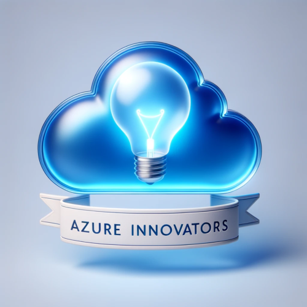

# Azure Innovators Hub

We're excited to be hosting an event at [Azure Innovators Hub](https://www.meetup.com/athens-azure-tech-group/)!

Our community is hosting all about Azure events as well as sessions that our members wish to see!

We are showcasing Azure SDKs, AI Applications, Infrastructure Management, Integration and Innovative solutions that will inspire and make your Cloud Journey quite exciting!

## Code of Conduct
https://passadis.github.io/azure-innovators/

## Latest Event

# Build a Multiagent Speech Web App using Azure Container Apps, React and Python

Join us for an exhilarating online event where technology meets creativity. This session is designed for developers, tech enthusiasts, and innovators who are eager to dive into the world of multiagent speech applications.
In this comprehensive workshop, you'll learn how to seamlessly integrate Microsoft Azure's cutting-edge AI capabilities and Azure Container Apps with the flexibility of React and the power of Python. Whether you're looking to enhance existing applications or build new ones from scratch, this event will equip you with the skills and knowledge needed to create responsive, intelligent speech-based applications.
Key Takeaways:

    - Understanding the Basics: Grasp the fundamentals of multiagent systems and their application in speech recognition and processing.
    - Integration Techniques: Learn how to integrate Azure's AI services with a React frontend and Python backend for a smooth, full-stack development experience.
    - Hands-On Experience: Follow along with live coding sessions and gain practical experience in building a speech app.
    - Networking Opportunities: Connect with like-minded individuals and industry experts to expand your professional network.
	
https://www.meetup.com/athens-azure-tech-group/events/299425483/
	

