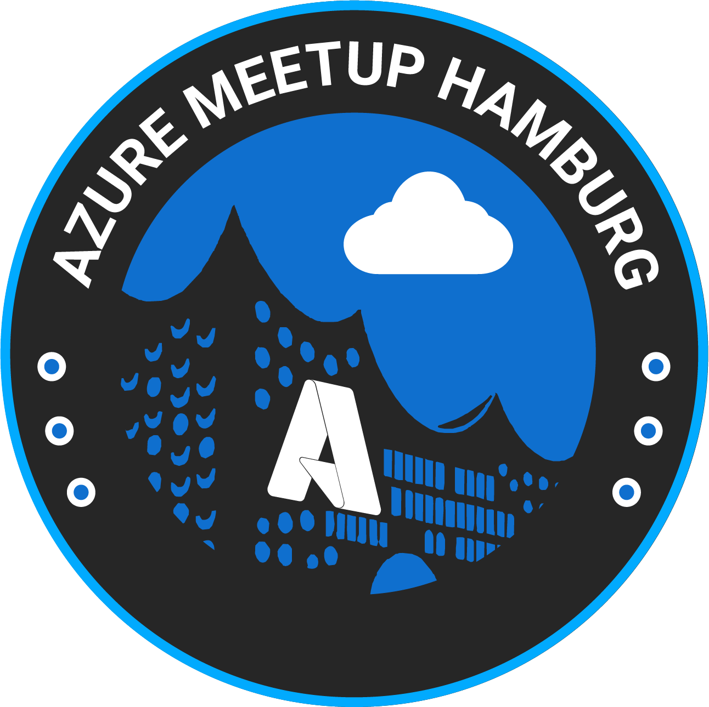

# Global Azure 2024 by Azure Meetup Hamburg

The Azure Meetup Hamburg is organizing Global Azure sessions and workshops on site on Friday, April 19, 2024. It's not just about technical insights and experiences, but also a day full of sharing experiences, networking, fun and many other surprises. 

The program and sessions will be announced soon, don't miss it!

[Visit our meetup page and join us for the next meetup!](https://www.meetup.com/azure-meetup-hamburg/)

## Call for Speakers

If you want to submit a session, please use the official CfS page [here](https://sessionize.com/global-azure-2024-hamburg/)

Please consider the following before submitting a session:

- We are looking for sessions and workshops
- Submitted sessions should mainly revolve around Microsoft Azure Services or projects implemented with them
- The session length is 45 minutes, workshops are 120 minutes
- The primary language is German, but English presentations are also welcome
- The sessions should offer as much hands-on and demos as possible, no marketing slides
- Unfortunately, we cannot cover travel or accommodation costs

If you have any questions, feedback or thoughts, please reach out to the community organizers at:

https://www.meetup.com/azure-meetup-hamburg/