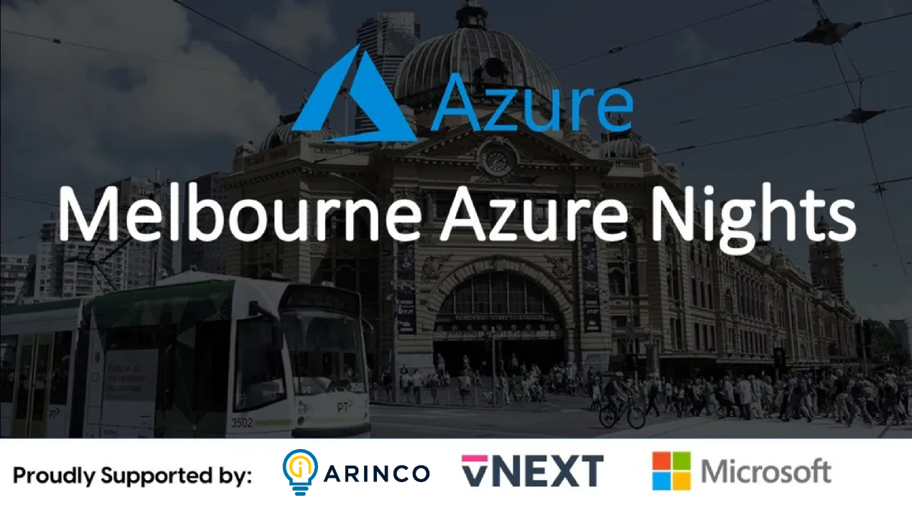

# Global Azure Melbourne by Azure Nights Melbourne

[Visit us here!](https://www.meetup.com/en-AU/melbourne-azure-nights/)

Global Azure Melbourne is a community event organized by the Melbourne Azure Nights User Group.
All around the world user groups and communities are sharing knowledge to professionals that want to learn more about Microsoft Azure and Cloud Computing!
On Apr 20, 2024, we will come together to once again bring the Global Azure event! The Azure User Group Melbourne brings a one day world-class event on Microsoft Azure. Join us online and don't forget to use the social hashtags #MelbourneGlobalAzure and #GlobalAzure!

The [Call for Speakers is now closed.](https://sessionize.com/global-azure-bootcamp-2024-melbourne/). View our agenda here: [Melbourne 2024 Schedule]([https://sessionize.com/global-azure-bootcamp-2024-melbourne/](https://melbourneazurebootcamp.com/#schedule))

Key information:
* 📅 April, 20 2024
* 🏠 RMIT Storey Hall, Building 19
* 🎫 Get your FREE ticket - [Meetup](https://www.meetup.com/melbourne-azure-nights/events/297604687/)
* 🎙️ Call for speakers - [https://sessionize.com/global-azure-bootcamp-2024-melbourne/](https://sessionize.com/global-azure-bootcamp-2024-melbourne/)
* 💶 Sponsors - We are looking for sponsors. Reach out to the organization team at [info@melbourneglobalazure](mailto:info@melbourneglobalazure) [https://www.meetup.com/en-AU/melbourne-azure-nights/](https://www.meetup.com/en-AU/melbourne-azure-nights/)

If you have any questions, feedback or thoughts, please reach out to the community organizers at:
* https://www.meetup.com/en-AU/melbourne-azure-nights/
* [info@melbourneglobalazure](mailto:info@melbourneglobalazure) 
