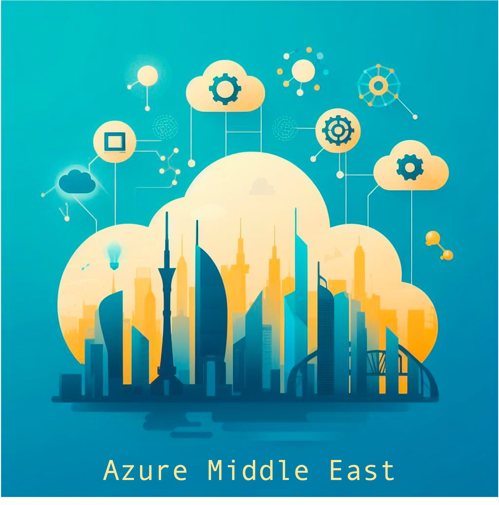

# Global Azure Dubai By Azure Middle East

Join us for the most anticipated cloud event of the year - Global Azure 2024 in Dubai! Hosted by the Azure Middle East community, this event is part of a worldwide celebration of Azure that brings together technology enthusiasts, industry professionals, and community leaders. 🌐✨

📅 Date: April 18th-20th 
📍 Location: Dubai, UAE 

Dive into sessions related to AI, Hosting web applications, Kubernetes, and more by our esteemed speakers, all sharing their expertise on Microsoft Azure. Whether you’re a developer, IT professional, or just passionate about cloud technology, there’s something for everyone.
Don’t miss this opportunity to:
* Learn from the best-in-class community leaders
* Explore the latest Azure innovations and solutions
* Network with peers and industry experts
* Participate in hands-on workshops and live streams
Be a part of the Azure revolution and help shape the future of the cloud. Let’s innovate, learn, and grow together! 🚀
For more information and to register, visit the official Global Azure website. See you in Dubai! #GlobalAzure #AzureMiddleEast

