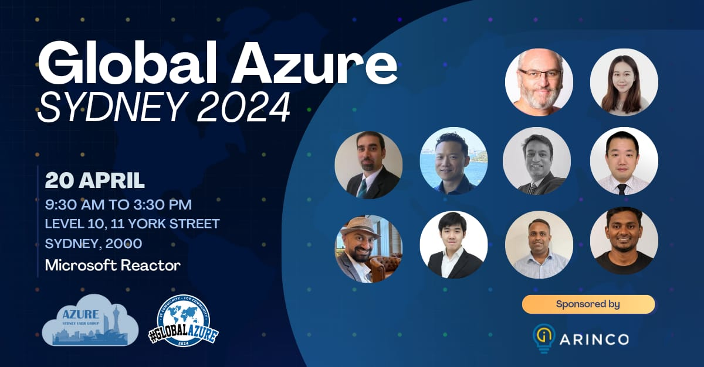

We are thrilled to announce the return of the in-person event and the hosting of Global Azure Day 2024 for the Sydney community.

Global Azure is from the community, for the community. During this global event, communities worldwide will organise local editions, like this one for Sydney.

📅 April 20th, 2024  
📍 Microsoft Reactor Sydney  
📃 Event schedule and agenda for the day is available 👉 https://tinyurl.com/gas2024schedule  
🎫 Reserve your spot and get your FREE ticket 👉 https://www.tickettailor.com/events/azuresydneyusergroup/1193113    
🗣 CFP [Closed] ~~👉 https://sessionize.com/global-azure-sydney-2024/~~    

🤝 A massive thank you to our sponsor [Arinco](https://arinco.com.au/) for supporting our community and Global Azure Sydney 2024.

👉 If you have any questions, feedback or thoughts, please get in touch with the community [leadership team](https://www.meetup.com/azure-sydney-user-group/members/?op=leaders).  

🔗 More details will follow via our [Meetup page](https://www.meetup.com/Azure-Sydney-User-Group/).