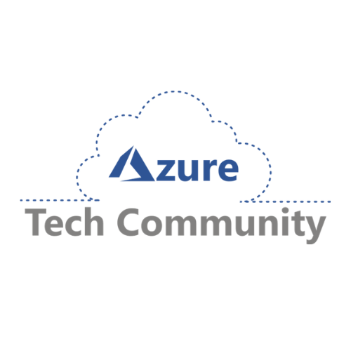

# Azure tech Community Mumbai

- Join our Community: [https://www.meetup.com/Emerging-Technology-Meetup/]

Welcome to Global Azure Bootcamp 2023!

Welcome to the Global Azure Bootcamp - an annual event that brings together thousands of professionals from around the world to learn and share their experiences with Microsoft Azure. This one-day event provides an opportunity for attendees to network with fellow Azure enthusiasts, learn about the latest trends and technologies in the Azure ecosystem, and participate in hands-on workshops and training sessions.

The Global Azure Bootcamp is a community-led initiative that was started in 2013 and has since grown into a global phenomenon with over 300 locations and 10,000 attendees in over 100 countries. The event is organized by local Azure user groups and Microsoft MVPs, who volunteer their time and expertise to create a valuable and engaging experience for participants.

Whether you're a seasoned Azure professional or just getting started with cloud computing, the Global Azure Bootcamp has something for everyone. From technical deep dives to business strategy sessions, you'll find a wide range of topics and formats to suit your interests and learning style. So, join us for a day of fun, learning, and community-building as we explore the power of Microsoft Azure together!

Join us at the Mumbai Global Azure Bootcamp!