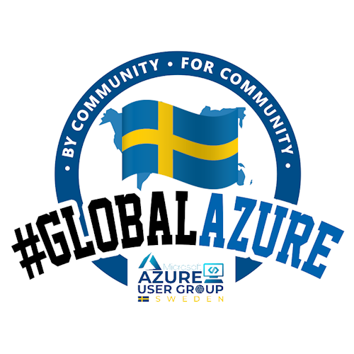

# Global Azure Sweden by Azure User Group Sweden 

[ "Visit us here!")](https://sessionize.com/global-azure-sweden-2024//)

Global Azure 2024 is a virtual conference taking place from April 18 - 20.

This is a community driven iniative and previous years there were over 250 speakers from all around the world delivering some 300 sessions.

As part of this global initiative Azure User Group Sweden is organizing a virtual conference on Saturday April 20th.

If you want to present we at Azure User Group Sweden will be hosting a platform for you so that you can focus on your presentation and leave the technical details to us!

We welcome any talks both beginner, intermediate and advanced as long as it is related to Azure.

We are looking forward to your submissions.

Join us in-person and don't forget to use the social hashtags #GlobalAzureAO and #GlobalAzure!

If you have any questions, feedback or thoughts, please reach out to the community organizers at: [Azure User Group Sweden](https://www.meetup.com/azureusergroupsundsvallsverige)
