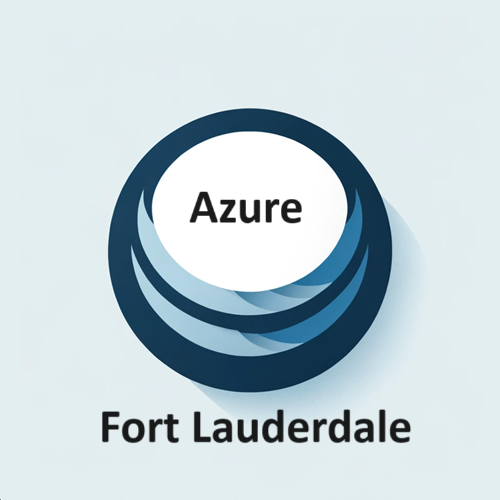

# Azure Global Fort Lauderdale

We're excited to be hosting 2024 [Mini-Conference](https://www.meetup.com/microsoft-azure-broward-county-florida/events/299908640/?isFirstPublish=true)

* Azure Global 2024 Mini-Conference is a one-day event designed to bring together cloud professionals, developers, IT experts, and technology enthusiasts from around the globe. This event is packed with insightful keynotes, breakout sessions, and interactive workshops, all focused on the latest trends, innovations, and best practices within the Microsoft Azure ecosystem

* Attendees will have the unique opportunity to:
    * Learn from the Experts: Engage with Azure experts and industry leaders who are shaping the future of cloud computing. Gain deep insights into Azure's advanced features, security enhancements, and innovative solutions for complex business challenges.

    * Networking Opportunities: Connect with peers, meet new professionals in your field, and exchange ideas in a vibrant, collaborative environment. This is a chance to build valuable relationships that can lead to future collaborations or career opportunities.
