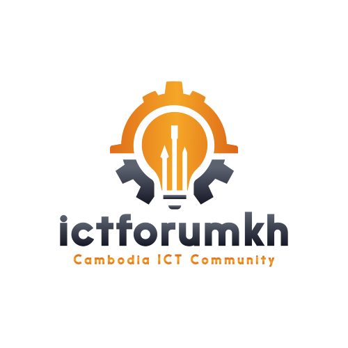

# ICT Forum KH

  

[www.ictforumkh.com](http://www.ictforumkh.com)
  
Experience the forefront of cloud technology with the Microsoft Azure Global Bootcamp, proudly hosted by ICT Forum Cambodia. This exclusive event offers participants a unique opportunity to delve deep into the diverse functionalities and cutting-edge innovations of the Azure platform. Through engaging workshops, expert-led sessions, and interactive demonstrations, attendees will uncover the transformative power of Azure solutions in driving business growth and innovation. Whether you're a seasoned professional or new to cloud computing, join us for a day of discovery, networking, and skill-building at the forefront of digital transformation

####  Event

 - Date - 18 May 2024 
 - Time - 1.30 to 4.30 PM 
 - Location -  Auditorium, Black OX HQ Building, NR 06, Phnom Penh, Cambodia, Phnom Penh, Cambodia 
 - Link - [https://ictforumkh.com/calendar.php?action=event&eid=5](https://ictforumkh.com/calendar.php?action=event&eid=5)

#### Speaker - Sampath Perera
Visionary Technology Entrepreneur with 15+ years of experience driving corporate success through expert alignment of technical resources. Skilled in Azure and Microsoft technologies, I bring innovative strategies to enhance profitability, productivity, and performance. Multilingual leader known for crafting customized solutions to meet strategic objectives, improve operational efficiency, and drive business expansion

#### Agenda
- Introduction to Azure
   
- Azure AD Migration
   
- Exchange Server Migration
   
 - Desktop Migration to Azure
   
 - Server Migration to Azure
   
 - Hybrid Cloud Integration
