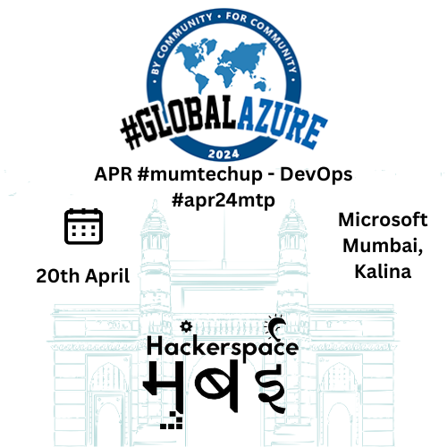

# Global Azure Bootcamp 2024 -Mumbai

## नमस्कार, मुंबई 🙏

Hey tech enthusiasts and cloud aficionados, get ready to supercharge your skills at the Global Azure Bootcamp 2024 - Mumbai edition #gab24mum in April! Join us for an exhilarating day of DevOps discovery, where you'll dive into the world of Azure with fellow Mumbai techies. This isn't your average sit-and-nod event; it's a #mumtechup party where learning meets fun!

​Mark your calendars for April 20th, because we are hosting a jam-packed session that you won't want to miss. We're gathering at the vibrant Microsoft space in Kalina, Santacruz East, where the only thing hotter than the Mumbai sun will be the Azure tips and tricks you'll pick up. Bring your energy, bring your questions, and let's make this bootcamp the talk of the tech town! 🚀🎉

As always all our sessions will be free and open to the public. We are committed to your privacy, and your data will never be shared.

We strive for diversity, inclusiveness, and equity. All are invited to apply, and we strongly  encourage first time speakers and especially, folks identifying themselves as part of an underrepresented minority[URM] in the Mumbai technology ecosystem to apply to our [Call for Papers[CfP]](https://sessionize.com/gab2m4um/).

This will be our 6th straight Azure Global Bootcamp; previous editions were held in [2018](https://gab18mum.eventbrite.com/), [2019](https://gab19mum.eventbrite.com/), [2021](https://gab21mum.eventbrite.com/), [2022](https://gab22mum.eventbrite.com/) & [2023](https://gab23mum.eventbrite.com/). We skipped 2020 due to the `COVID pandemic`.

-------------------------------------------------
Hosted by [Hackerspace Mumbai](https://www.hackmum.in/), the city's largest OSS community, and organizers of its longest running [tech meetup](https://www.meetup.com/Mumbai-Technology-Meetup/) #mumtechup

All our events are free for all attendees. We are committed to your privacy, and your data will never be shared.

Everyone associated with our events, including but not restricted to organizers, speakers, and attendees, are expected to abide by our [Code of Conduct](https://github.com/HackerspaceMumbai/HackerspaceMumbai/blob/master/CODE_OF_CONDUCT.md).

If you have any questions, feedback or thoughts, please reach out us at any of the social media coordinates given above or email us <community@hackmum.in>

You can find us on [Twitter](https://twitter.com/hackmum), [Facebook](https://fb.com/hackmum), [LinkedIn](https://www.linkedin.com/company/hackerspace-mumbai), [Youtube](https://www.youtube.com/c/HackerspaceMumbai), and [Github](https://github.com/orgs/HackerspaceMumbai/)
