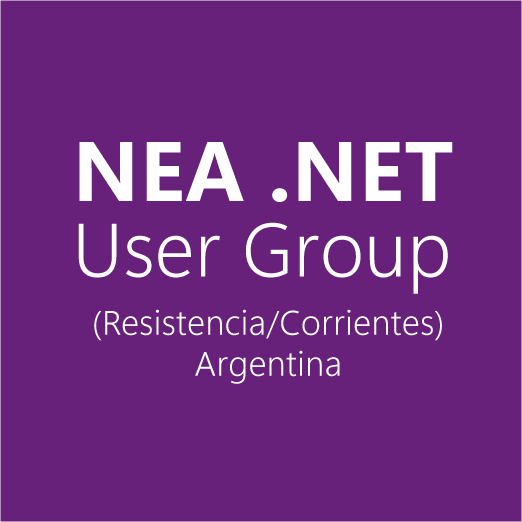
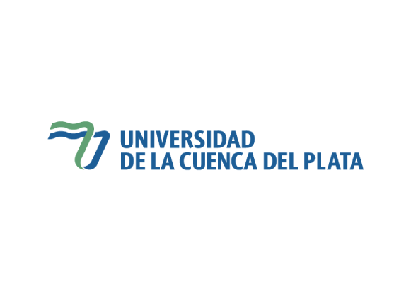

# NEA .NET User Group (Resistencia/Corrientes) Argentina

# Global Azure Corrientes (Argentina)

Global Azure Corrientes (Argentina), es un evento organizado por la comunidad .NET de la región **NEA .NET** en colaboración con la [**Universidad de la Cuenca del Plata**](https://www.ucp.edu.ar/)

El próximo Viernes 19 de Abril de 2024 a las 18hs, nos encontraremos para compartir las novedades y mejores practicas para el uso de Azure. En esta oportunidad contamos con una sede presencial en la [UCP | Universidad de la Cuenca del Plata, Corrientes, Argentina](https://maps.app.goo.gl/hfVY8X4gtHdHKqjJA)

Información:

* 📅 Viernes 19 de Abril de 2024 18hs
* 🏠 [Lavalle 50, Corrientes Capital | Universidad de la Cuenca del Plata, Sede Central, Corrientes, Argentina](https://maps.app.goo.gl/hfVY8X4gtHdHKqjJA)
* 🎫 Evento gratuito con registro previo. [Para la inscripción click aquí](https://actividades.ucp.edu.ar/public/detalle/240)

## Temas
 - Gestionando el almacenamiento en la nube escalable con Azure blob service (Ing. Marcos Polischuk)
 - Agregando a nuestras apps servicios de IA: Ejemplos con Azure IA Vision (Ing. Jose A. Fernandez)
 - Chatbots con IA utilizando Language Studio (Ing. Augusto Portillo)
 - Entornos híbridos de alta disponibilidad con Microsoft SQL Server AlwaysOn (Ing. Humberto Oraison)

## *Agradecimientos*

[Universidad de la Cuenca del Plata](https://www.ucp.edu.ar)

