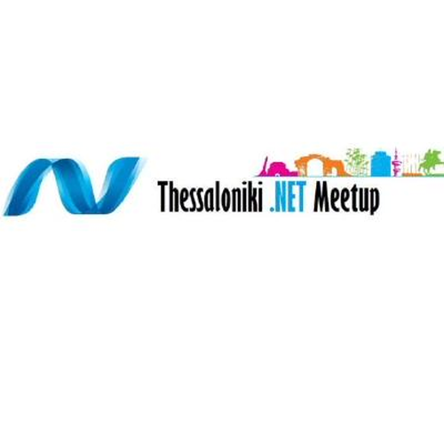

# Thessaloniki.net Meetup Global Azure 2024

We're excited to be hosting an event at [Thessaloniki.net meetup]([https://globalazure.net/this-is-just-a-sample-link/](https://www.meetup.com/thessaloniki-net-meetup/))!

If you have any questions, or you want to participate with a presentation, you can ask us in the following link:
https://www.meetup.com/thessaloniki-net-meetup/

AGENDA
 |  | Title | Speaker |
| --- | ----- | ------- |
| 09:00-09:30 | Opening ceremonies | |
| 9:30-10:10 | Data Science in the New Fabric Era | Vangeli Misirlis |
| 10:10-10:50 | Optimizing Azure Infrastructure Management with Azure Bicep | George - Chrysovalantis Grammatikos |
| 10:50-11:05 | Break | |
| 11:05-12:15 | Getting started with Azure OpenAI Service | George Spyrou |
| 12:15-12:55 | Medallion Architecture in a Microsoft Fabric lakehouse | Antonios Chatzipavlis |
| 12:55-13:10 | Break | |
| 13:10-13:50 | Unlock the Power of .NET in the Cloud: Journey into the Future with .NET Aspire | Orestis Meikopoulos |
| 13:50-14:30 | WhatsApp messaging integration in our apps with Azure Communication Services | Luis Beltran |

Organizers: 

* Stratos Kourtzanidis 
* Konstantinos Ziazios 
* Charalampos Karypidis
