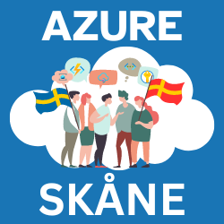
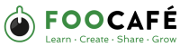

# Azure Sk&aring;ne

Global Azure is the epitome of community events and Azure Skåne could not miss the opportunity to take part. Thanks to our hosts, Foo Café, we had the joy to hold 2 sessions and close the evening with some delicious pizza and mingle. The room was packed and hopefully, everyone had a great time.

 
<h3>Session #1: Negar Shahbaz - Let’s build a Conversational bot with Azure AI Search & Azure OpenAI</h3>
 

Generative AI and GPT-based solutions are at peak hype and one of the common use cases for leveraging Generative AI power is through conversational bots. In this session, we will build a chatbot that engages in conversational discussion providing sophisticated responses based on information derived from an organizational knowledge base. On architectural view, the chatbot rides on Azure AI Search index and Azure OpenAI service to carry the conversation with semantic responses.
 

<h3>Session #2 (the duet): Saeid Dahl & Nikos Delis Edge-to-Cloud connectivity, the power of Azure Arc and Azure IoT</h3>
 

In this session, we delve into the powerful synergy of Azure Arc, Kubernetes, and Azure IoT. We’ll guide you through the journey of deploying a Kubernetes cluster using Azure Arc. Within this cluster, we’ll create a pod housing a .NET application that diligently sends telemetry data to Azure IoT Hub. From there, the magic unfolds as Azure Data Explorer steps in to ingest, analyze, and visualize this rich stream of data. Join us to explore how these interconnected services empower your hybrid environment, bridging the gap between on-premises and cloud data ecosystems

Both sessions can be attended in the following video:

<h3>Speaker profiles:</h3>

Negar Shahbaz: [LinkedIn](https://se.linkedin.com/in/negar-shahbaz)

Saeid Dahl: [LinkedIn](https://se.linkedin.com/in/saeid-dahl)

Nikos Delis: [LinkedIn](https://se.linkedin.com/in/nikos-delis-83435232)

Our community operates in the south of Sweden, based out of Malm&ouml;. We strive to run monthly meetups, and to invite interesting speakers with exciting Azure topics. We are set up to live stream and you can visit our events to view them live and socialize with the other members.

[Please pop into our Meetup page and have a look at our community and our activities - and do join our over 1 000 members!](https://www.meetup.com/Azure-Skane/)

If you have any questions, feedback or thoughts, please reach out to the community organizers:

* Goran Vuksic
* Magnus M&aring;rtensson [Azure MVP](https://mvp.microsoft.com/en-us/PublicProfile/4038183) & [Microsoft RD](https://rd.microsoft.com/en-us/magnus-martensson) [@noopman](https://twitter.com/noopman)
* Michael Jonsson [@Michael_Jonsson](https://twitter.com/Michael_Jonsson)
* Negar Shahbaz [@NegarShahbaz](https://twitter.com/NegarShahbaz)
* Nikos Delis [@ndteknik](https://x.com/ndteknik)

We arrange our meetup events at:

