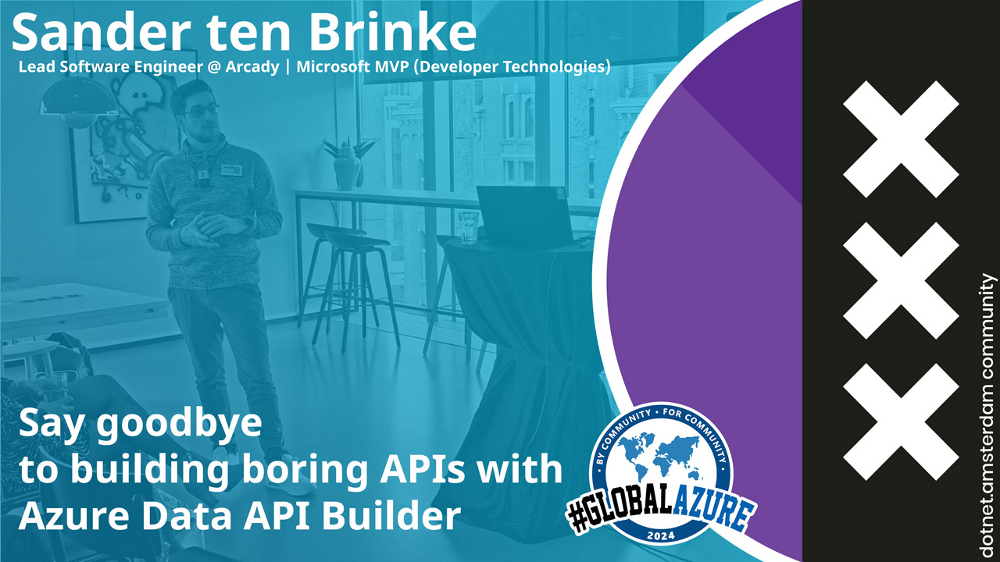
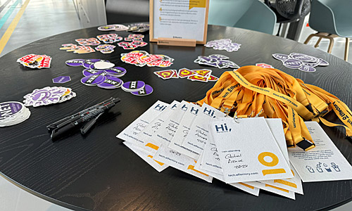
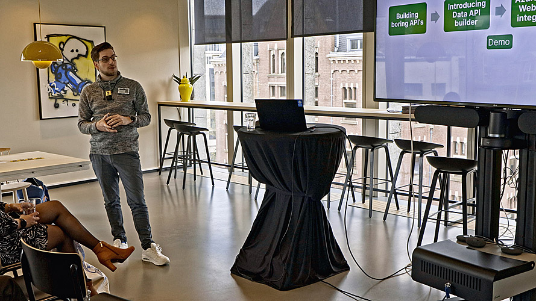
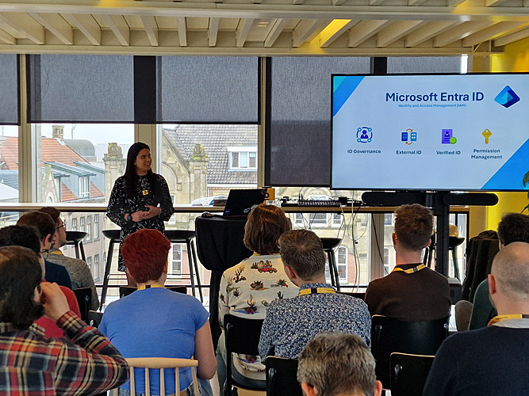
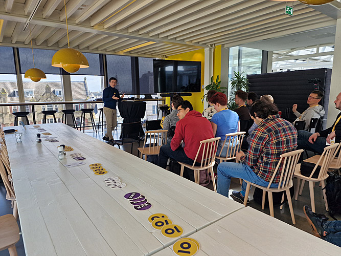
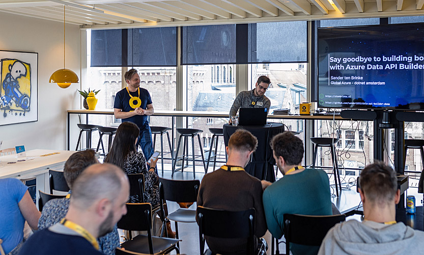

# Global Azure local event by dotnet.Amsterdam

We're excited to be hosting an event at the [dotnet.Amsterdam community](https://www.meetup.com/dotnet-amsterdam/events/299447717/)!

Together, we made Global Azure 2024 on the 20th of April in Amsterdam an event to remember!

## Links
- Follow us on LinkedIn https://www.linkedin.com/company/dotnet-amsterdam
- Subscribe to our YouTube Channel https://www.youtube.com/@dotnetamsterdam
- Join us on meetup.com https://www.meetup.com/dotnet-amsterdam/

## Sessions/ recordings

### Anjuli Jhakry - Microsoft Entra External ID: easy authentication from your app to your API

https://youtu.be/CYvPi1zKFhU

Save yourself and your users time with Microsoft Entra External ID authentication. Microsoft Entra External ID provides built-in support for multiple identity providers, such as Google and Apple ID. With just a few clicks in Azure, and a few lines of code in your app, your users can sign in, sign out and a lot of other useful things. You don’t even have to worry about creating a login page!
 
In this session, you will learn the basics of Entra External ID, its benefits, and how to integrate it into your app and Azure. This includes a walkthrough on setting up Entra External ID and a demonstration of how you can log in with a .NET MAUI app and access an API.

Anjuli Jhakry
Software Developer @ 4DotNet

Meet Anjuli Jhakry: A .NET developer at 4DotNet by day and a .NET MAUI explorer by night. I'm navigating the vast ecosystem of Microsoft, always eager to learn. Beyond this, I am passionate about giving presentations and advocating for the incredible potential of tech to everyone.

- https://www.linkedin.com/in/anjuli-jhakry-1b8169116/
- https://twitter.com/ALJhakry
- https://www.instagram.com/codewithanjuli/
- https://www.youtube.com/@CodeWithAnjuli
- https://www.tiktok.com/@codewithanjuli

### Daniel Costea - Deep dive into Microsoft Semantic Kernel Agents powered by AI Assistants

https://youtu.be/HFGr4j9b698

You may be interested in creating agents with the Microsoft Semantic Kernel using GPT Assistants for handling complex problem-solving tasks. It uses AI to coordinate the work among multiple assistants. Each assistant has its own persona and tools, operating as separate GPTs. The days of manually managing conversation states and chat threads are behind us. Now, with the support of these assistants, we can have conversations that remember their context. 

In the next talk I explore how these assistants can interact in three different scenarios: 
- hierarchical chat agents (interactive chat) 
- joint chat agents (interactive chat) 
- agent powered by agents as plugins chat (one prompt chat) 

For this, I have created four agents, each representing a different hero: Jack Sparrow, Don Quijote, Shakespeare, and Yoda. Additionally, I have a dialogue writer agent that takes a dialogue script and brings these heroes to life. Well, let's see what happens when Jack Sparrow is messing up with Don Quijote!

Daniel Costea
Senior Software Engineer, Microsoft MVP

Daniel Costea is a senior software engineer with more than two decades of experience and a passion for C# since its inception in 2001. He has been a frequent international speaker in Europe and the US in the past 6 years, and has organized community meetings and workshops. As a trainer, Daniel has delivered over 1200 hours of training in .NET web technologies to more than 700 students. He is also a published author of articles on .NET technologies, and was recognized as a Microsoft MVP in developer technologies in 2019.

- https://www.linkedin.com/in/danielcostea/
- http://twitter.com/dfcostea
- http://apexcode.ro/

### Sander ten Brinke - Say goodbye to building boring APIs with Azure Data API Builder

https://youtu.be/l7GN46RuyCw

Developers often find themselves building APIs solely for data retrieval and storage, a task that can lack excitement and be very time-consuming. Enter Microsoft's open-source solution: Data API Builder. This tool enables you to securely expose your Azure database through REST and GraphQL endpoints, eliminating the need to manually write these APIs.

Join this session to explore the features, deployment options, and nuances of Data API Builder. We'll also showcase its seamless integration with Azure Static Web Apps.

Sander ten Brinke
Lead Software Engineer @ Arcady | Microsoft MVP (Developer Technologies)

 Microsoft MVP (verified)
Sander ten Brinke is a Microsoft MVP and Lead Software Engineer at Arcady, a Dutch IT consultancy firm based in Zwolle. He loves working with .NET, Azure, CI/CD and a whole lot more. He always stays up to date with all new technology and loves sharing his knowledge with everyone by speaking, blogging, podcasting and more!

- https://www.linkedin.com/in/sander-ten-brinke-295811a8/
- https://twitter.com/sandertenbrinke
- https://stenbrinke.nl/

## Photos

