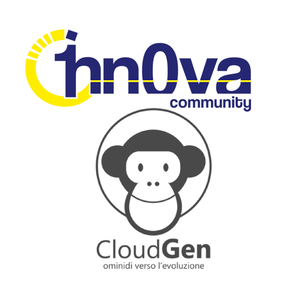

# Global Azure 2024 Pordenone by 1nn0va and CloudGen

[Visit us here!](https://gab2024pn.1nn0va.it/)

Global Azure 2024 Pordenone is a community event organized by 1nn0va and CloudGen together.
All around the world user groups and communities are sharing knowledge to professionals that want to learn more about Microsoft Azure and Cloud Computing!
On Apr 20, 2024, we will come together to once again bring the Global Azure event! 1nn0va and CloudGen brings a one day world-class event on Microsoft Azure. Join us online and don't forget to use the social hashtags #GlobalAzure!

The [Call for Speakers is open](https://sessionize.com/gab2024pn). Selection will happen on an ongoing basis. Don't wait to the last day to submit your sessions!!!

Key information:

- 📅April, 20 2024
- 🏠Consorzio Universitario di Pordenone - Via Prasecco 3/a, Pordenone
- 🎫Get your FREE ticket - [Meetup](https://gab2024pn.1nn0va.it/register.html)
- 🎙️Call for speakers - [https://sessionize.com/gab2024pn](https://sessionize.com/gab2024pn)
- 💶Sponsors - Thanks to our sponsors [Altitudo](https://www.altitudo.com),[beanTech](https://www.beantech.it), [Stesi](https://www.stesi.it). If you want to help us to make this event better, please contact us here [Marco Parenzan](https://www.linkedin.com/in/marcoparenzan/) or [Andrea Tosato](https://www.linkedin.com/in/andreatosato/)
