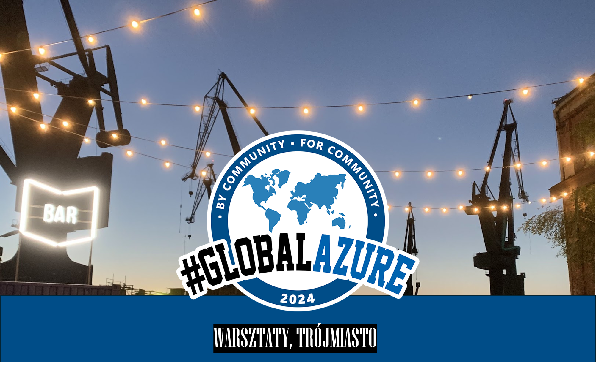

# Global Azure Trójmiasto

Azure User Group Poland, Trójmiasto invites to Azure Global on-site workshops in Gdańsk, Poland and following Azure Global Poland online sessions.

**On-site workshop for Azure Developers**
* 📅 April, 18 2024, 12:00-16:00
* 🏠 Dynatrace, Gdańsk Poland
* 🎫 Get your FREE ticket - [Eventbrite](https://www.eventbrite.com/e/global-azure-2024-warsztaty-trojmiasto-tickets-861127725207)
* 💶 Sponsors - [Dynatrace](https://careers.dynatrace.com/locations/gdansk)

**Online sessions**
* 📅 April, 19 2024, 12:00-16:00
* 🏠 Online
* 🎫 Get your FREE ticket - [Eventbrite](https://www.eventbrite.com/e/global-azure-2024-poland-on-line-tickets-843540521407)

If you have any questions, feedback or thoughts, please reach out to the community organizers:

- Paweł Siwek [Principal Product Architect](https://www.linkedin.com/in/pawelsiwek/)
- Grzegorz Meger [Cloud Solution Archictect](https://www.linkedin.com/in/gmeger/)

 
