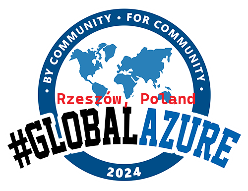

# Global Azure Rzeszów

Azure User Group Poland, Trójmiasto invites to Azure Global on-site workshops in Gdańsk, Poland and following Azure Global Poland online sessions.

**On-site workshop** 
* ⚠️ Please note: workshops will be **on-site** only, will be in polish, there are **10 spots** availabe
* Wprowadzenie do Infrastructure as a Code dla ITOps - jak napisać swój pierwszy kod z wykorzystanie bicep
* 📅 April, 18 2024, 17:00-21:00
* 🏠 SII Polska, Rzeszów Poland
* 🎫 Get your FREE ticket - [Eventbrite](https://www.eventbrite.com/e/wprowadzanie-do-infrastructure-as-code-w-azure-z-wykorzystanie-microsoft-bicep-jak-napisac-swoj-p-tickets-876288170507)
* 💶 Sponsors
  - 

**Online sessions**
* 📅 April, 19 2024, 12:00-16:00
* 🏠 Online
* 🎫 Get your FREE ticket - [Eventbrite](https://www.eventbrite.com/e/global-azure-2024-poland-on-line-tickets-843540521407)

If you have any questions, feedback or thoughts, please reach out to the community organizers:

- Michał Machniak [Head of Cloud Department (Lead Architect) ](www.linkedin.com/in/michal-machniak)
- Maciej Skuratowski [Azure Solutions Architect](https://www.linkedin.com/in/maciejskuratowski/)
