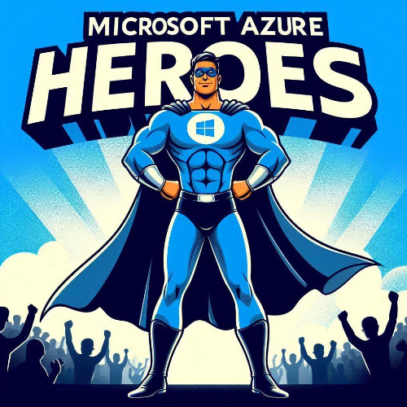

# Azure Heroes Netherlands

We're excited to be hosting an event at [Azure Heroes Meetup Page](https://www.meetup.com/azure-heroes-netherlands/?eventOrigin=event_home_page)!

Azure Heroes Netherlands is hosting an incredible community event organized by the Azure Heroes Netherlands Team! Around the globe, user groups and communities are sharing their expertise with professionals eager to learn more about Microsoft Azure and Cloud Computing. Mark your calendars for May 8, 2025, as we unite once again for the Global Azure event! Expect a full day of top-notch sessions on Microsoft Azure, brought to you by the Azure User Group Netherlands. Join us online and don’t forget to use the social hashtags #GlobalAzureNL and #GlobalAzure!

The Call for Speakers is coming soon. Submit your sessions early to secure your spot!

Event details:

📅 Date: May 8th, 2025

🏠 Location: Schuberg Philis https://maps.app.goo.gl/h5MtzPcgoUzBet2y7

🎫 Get your FREE ticket: coming soon

🎙️ Call for Speakers: coming soon 

💶 Sponsors: We’re on the lookout for sponsors! Reach out to the organizing team at Azure User Group Netherlands
If you have any questions, feedback, or thoughts, please get in touch with the community organizers at:

Contact djskruge@gmail.com
