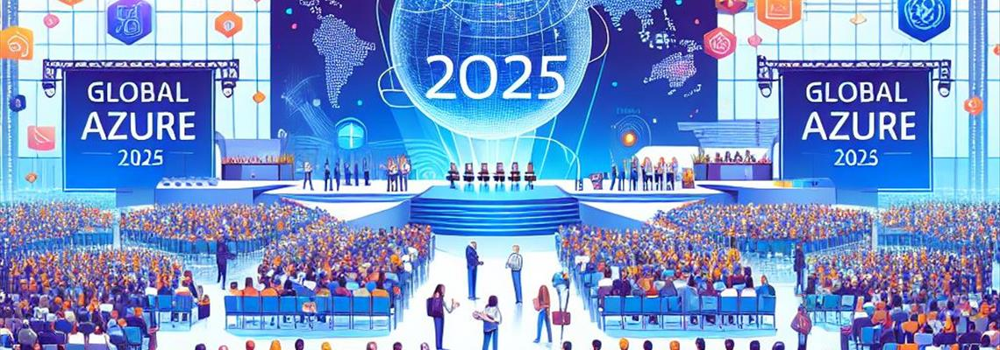

We are thrilled to announce the return of the in-person event and the hosting of Global Azure Day 2025 for the Sydney community.

Global Azure is from the community, for the community. During this global event, communities worldwide will organise local editions, like this one for Sydney.

We are currently in the process of planning our schedule for the day. A full-day Azure event covering diverse topics is being strongly considered, and we will keep you updated as we finalise the details.

📅 Saturday, May 10th, 2025  
📍 Microsoft Reactor Sydney  
🗣 Call for speakers: TBA    
📃 Event schedule and agenda for the day : TBC  
🎫 FREE ticket registration: TBA    

🤝 Sponsors - Join us in making this event a success! We have exciting opportunities for sponsors who want to make a meaningful impact - If you’re interested, we’d love to partner with you!

👉 If you have any questions, feedback or thoughts, please get in touch with the community [leadership team](https://www.meetup.com/azure-sydney-user-group/members/?op=leaders).  

🔗 More details will follow via our [Meetup page](https://www.meetup.com/Azure-Sydney-User-Group/).